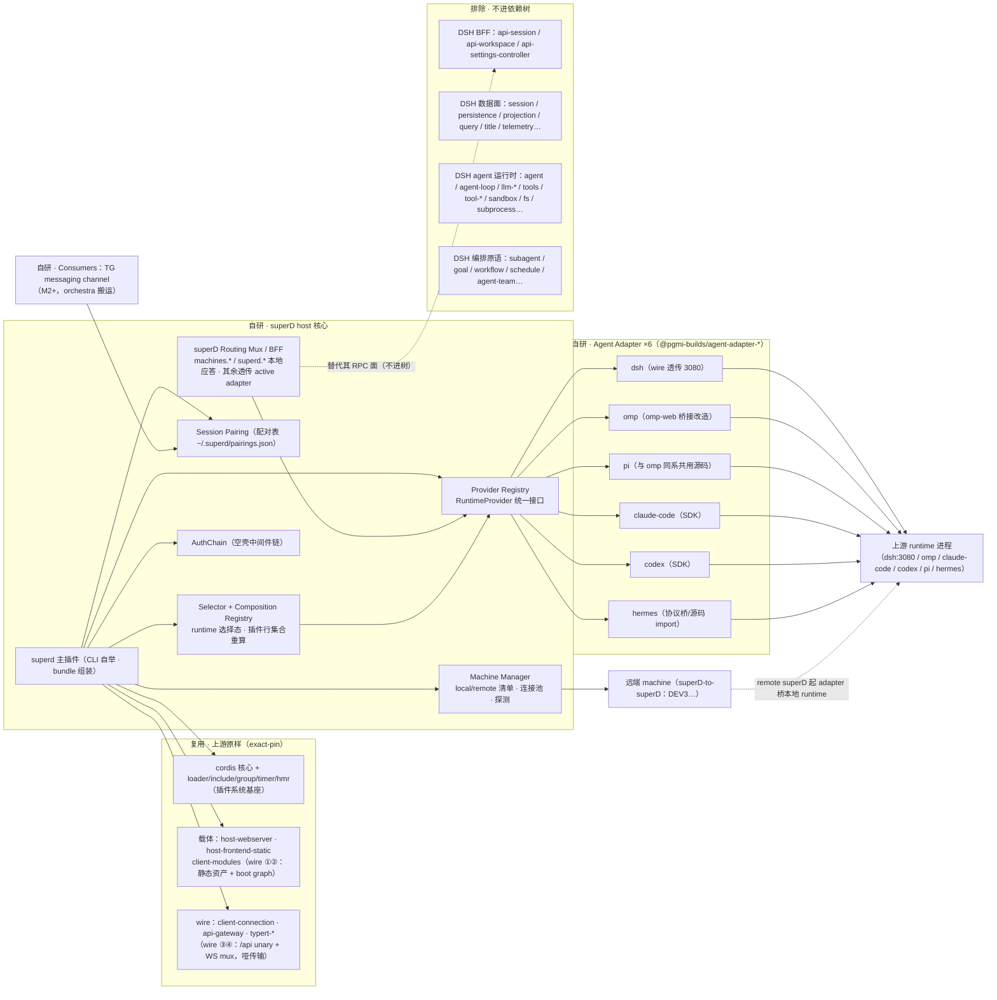
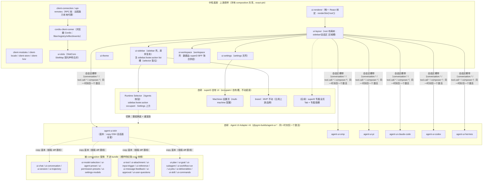

# Super D 组件边界与 UI 组合层（v0.3）

> 2026-09-08 · 比蓝图细一层：组件级"复用 / 替换 / 排除 / 自研"边界，两幅 Mermaid + 包 roster
> 草案。蓝图见 `00-blueprint.md`（v0.2，§3.5 对偶裁决）。
> 上游包事实依据：`../60_exploration-and-research/02-dsh/dsh-web-profile-package-map.md`（220 包
> 四层分类）与 `dsh-web-ui-slot-system-research.md`（插槽机制一手核验）；机制语言层依据：
> `../60_exploration-and-research/02-dsh/dash-research.md` §1「"Everything is plug-in" 的语言层
> 实现」。本文回答：DSH 现有包里哪些拿来做依赖、哪些明确不要（如 DSH Session Controller）、
> 自研 agent adapter 补在哪、前端组合层替换 DSH UI 的哪一段。
> 2026-09-08 v0.2 修订：BFF 定性为 routing mux（namespace 分流）；ui-sidebar 移入 superD 自有
> shell；selector 位置与品牌 MVP 策略落位；DSH 认证链速查见 §2 要点（全文：蓝图 §3.6）。
> 2026-09-08 v0.3 修订：selector 移位侧栏底部（`sidebar.footer.action` list 槽 occupant，
> Settings 上方），superd-sidebar copy 撤回，ui-sidebar 回归中性底座（蓝图 §3.7 v0.4 / 决策 #24）。

---

## 1. 前后端对偶总则

- 后端 **Agent Adapter**（数据面）：把 runtime 的字段/事件映射到 superD 标准字段（DSH
  SessionEvent 词汇）。统一 `RuntimeProvider` 接口，一个 runtime 一个包。
- 前端 **Agent UI Adapter**（呈现面，机制 = 插槽组合）：把标准字段渲染成该 runtime 的 UI
  形态。一个 runtime 一个包，从 agent-ui-dsh 蓝本 copy 起步。
- 两者都是 cordis 插件；**同一 selector 驱动、同组启停**——一个 runtime 落地为一对包：
  `@pgmi-builds/agent-adapter-x` + `@pgmi-builds/agent-ui-x`。
- **切换 = 组合重算**：selector 变更 → 插件行集合（空间数据）一次变更 → 时间维机制（受影响
  fiber 的 unload → reload 重放）落地 → 插槽树重渲染。这是 "everything is plug-in" 的机制内
  行为（epoch 签名驱动），不是 hack；语言层同构案例见 dash-research §1(5) 的 provider 切换。
- **互斥不变量**：同一时刻仅一个 composition 激活。conversation.* 槽带同 key 双注册会撞、
  list 槽会叠渲染）——互斥由 host 侧 Composition Registry 保证（按 selector 算出互斥插件行集）。
- **DSH 面 = 全透传 + routing mux**：superD 自有 namespace（`machines.*` / `superd.*`）本地应答，
  其余按 active adapter 转发；DSH 三面（session/workspace/settings）逐帧透传、零翻译（蓝图 §3.6）。

---

## 2. Host 侧组件边界



要点：

- **载体层原样**：webserver / frontend-static / client-modules / connection / gateway 保持上游
  依赖——wire 面 100% 兼容、升级跟随 upstream，锁版策略对冲无稳定性承诺的风险（蓝图 §2/§5）。
- **替换层 = thin routing mux，不是全量重实现**：DSH 三个 BFF controller（**含 DSH Session
  Controller**）不进依赖树；superD 侧按 RPC namespace 分流——自有面本地应答，其余透传 active
  adapter（DSH 面逐帧零翻译，UI 与上游锁死同版 ⇒ 契约逐字节一致）。
- **DSH 认证链速查**：machine token 一次性 mint `dsh-auth-*` cookie（HMAC 签名、持久 secret ⇒
  cookie 跨上游重启有效，默认 30 天）→ adapter 服务端 cookie jar 附带转发；loopback Host 天然过
  信任栅栏。源码锚点与 mint 流程见蓝图 §3.6。
- **排除层**：DSH 的会话数据面、agent 运行时、编排原语整体不引入。superD 不跑 agent、不存原始
  会话（唯一持久状态是 pairing 表）。这些包不是"被 patch 掉"，而是**根本不出现在 bundle 里**。
- **远端**：v1 仅 superD-to-superD；CLI 型 runtime 必须由远端 superD 本地桥接（蓝图决策 #17）。

---

## 3. 浏览器侧组件边界（Agent UI Adapter 替换带）



要点：

- **中性底座 = 上游原样依赖**：插槽机制（ui-slots）、渲染器（ui-renderer）、布局树（ui-layout）、
  主题、settings 页壳、sidebar 壳、wire 桩。换 runtime 不动这一层——对应 DSH 前端"框架中立
  内核 + 可替换渲染后端"的既有分层。
- **替换不是 patch，是不进 bundle**：CUT 组的 DSH 包（ui-chat / ui-conversation / ui-session /
  …）直接不进依赖树；composition 包 copy 了它们的源码，**槽声明权（SlotMap 契约合并 + 槽
  注册）随 copy 转移**给 composition。底座的 layout 只认槽带，不认包。
- **superD 自有 UI 全部走 occupant**：selector（Agents 按钮）= `sidebar.footer.action` list 槽
  occupant（Settings 上方；owner 只给 `wide` 标志，rail 态渲染单图标，样式对齐 Settings 行）；
  Machines 挂 settings 页；brand MVP 不动；未来全页 Tab 走 ui-layout 声明新区域槽或自有路由
  槽——中性底座零 copy 例外（v0.4：superd-sidebar 计划撤回）。
- **数据来源不变**：composition 消费的仍是 api-remotes RPC 桩暴露的标准面（session/workspace/
  settings），服务端由 superD BFF + adapter 供给。前后端各自的"对偶替换带"互不越界。

---

## 4. 包 roster 草案（三档处置，M1 定稿——对齐蓝图开放问题 #6）

### ① 中性底座：原样依赖（exact-pin）

| 组 | 包 | 备注 |
|---|---|---|
| Cordis 框架 | `cordis`、`plugin-loader`、`plugin-include`、`plugin-group`、`plugin-timer`、`plugin-hmr`、`cosmokit`、`schemastery` | 插件系统基座，全量需要 |
| 载体（host） | `host-webserver`、`host-frontend-static`、`client-modules` | wire ①②（静态资产 + boot graph） |
| wire 双端 | `client-connection`、`api-gateway`、`api-remotes`、`typert-protocol/-registry/-loader`、`cordis-host-runner`、`cordis-client-runner` | wire ③④ + 浏览器 Cordis，哑传输/哑运行时 |
| 前端基建 | `client-locale`、`client-store`、`client-hmr` | observable/locale/热更基建 |
| UI 壳 | `ui-slots`、`ui-renderer`、`ui-layout`、`ui-sidebar`、`ui-theme`、`ui-settings`（页壳）、`ui-cordis`（调试面板） | 组合机制与布局骨架，所有 composition 共享（v0.4：sidebar 回归） |
| UI 壳（复核位） | `ui-workspace` | 壳可复用；数据面改由 superD BFF 聚合（machine/runtime 分组），M1 复核是否需 patch |

> v0.4 修订：~~ui-sidebar 移出中性底座~~ **撤回**——selector 移位侧栏底部 footer 区，落位现成
> list 槽 `sidebar.footer.action`（occupant 注册，渲染于 Settings **上方**堆叠；与 Settings 同行
> 不可行：owner 的 `footArea` 是 column 布局，occupant 改不了 owner）。ui-sidebar 回归中性底座
> 原样依赖，copy 例外清零（蓝图 §3.7 v0.4 / 决策 #24）。

### ② composition 蓝本：不直接依赖，copy 进 agent-ui-dsh 后派生 per-runtime 包

| 组 | DSH 源包（蓝本） | 说明 |
|---|---|---|
| 会话核心 | `ui-chat`、`ui-conversation`、`ui-session`、`ui-trajectory` | conversation.* 槽带的 owner，整组 copy |
| 模型/预设 | `ui-model-selection`、`ui-agent-preset`、`ui-permission-presets`、`ui-settings-models` | 模型列表/预设是 runtime 特有词汇 |
| 会话附属 | `ui-tool`、`ui-attachment`、`ui-input-trigger`、`ui-reference`、`ui-message-feedback`、`ui-approval`、`ui-user-questions` | 审批/提问面各 runtime 形态不一；缺字段 = 隐藏（降级容错是设计内行为） |
| DSH 深度面 | `ui-plan`、`ui-goal`、`ui-subagent`、`ui-workflow-run`、`ui-jobs`、`ui-deliverables`、`ui-skill`、`ui-commands` | DSH 特有编排/深度面；其他 runtime 按字段在场裁剪或整块不实现 |

派生纪律：`agent-ui-omp/-pi/-claude-code/-codex/-hermes` 一律从 **agent-ui-dsh**（而非上游原包）
fork 起步——蓝本已经过一次"去 DSH 宿主耦合"的整理，派生成本更低。

### ③ 排除：不进依赖树

| 组 | 包 | 理由 |
|---|---|---|
| DSH BFF | `api-session-controller`、`api-workspace-controller`、`api-settings-controller` | 替换层：RPC 面由 superD BFF + Provider Registry 接管 |
| DSH 数据面 | `session`、`session-persistence(-jsonl/sqlite)`、`session-projection(-cache)`、`session-query(-sqlite)`、`session-title*`、`session-stats`、`session-telemetry*`、`session-log-*`、`session-checkpoint-policy`、`session-reference` | superD 不存原始会话；唯一持久状态 = pairing 表 |
| DSH agent 运行时 | `agent`、`agent-loop`、`agent-presets`、`agent-default-model`、`agent-instructions`、`llm-*`、`tools`、`tool-*`、`shell*`、`bash-*`、`pwsh-*`、`sandbox*`、`fs*`、`subprocess*`、`code-runtime*`、`compaction*`、`spill*`、`credentials*`、`system-prompt`、`persona`、`mcp-client` | superD 不跑 agent、不含模型调用链（蓝图 §1） |
| DSH 编排原语 | `subagent*`、`goal*`、`workflow*`、`schedule`、`jobs*`、`experimental-agent-team`、`plan-mode` | 上游 runtime 自带编排；superD 只桥接 |
| 宿主杂项 | `plugin-inventory*`、`directory-picker-*`（暂缓）、`brand-official`（brand 槽由自有 occupant 替换）、`settings-plugins`/`settings-plugin-inventory`（superD v1 无插件管理面） | 按需再议；directory-picker 与 machine 语义耦合，M1 裁决 |
| 候补复核 | `dsh-settings`、`settings-file`、`storage*` | superD 自身设置面（machines/selector/TG bindings）的底座：复用或自研轻量 JSON，M1 定 |

---

## 5. 切换机制（两档实现）

**v1 简化档（M1 先用）**：

```
UI selector 切 runtime（settings CAS 写入）
→ host Composition Registry 重算互斥插件行集（disable 旧组 · enable 新组）
→ boot graph 随之变更（该组 client 模块表换装）
→ 前端整页 reload：client runner 按新组合重新拉模块、逐个 apply
→ SlotRegistry 重算 → renderSlot('root') 整树重渲染
```

成本最低，正确性靠"组合是声明式数据"保证——页面刷新只是最粗粒度的 reload。

**v2 热切换档（M2+ 增强）**：client-hmr 式 fiber 级换装，不整页刷新——旧行组 fiber unload
（LIFO 撤销槽注册）、新行组 reload 重放，React 树保持挂载、仅会话区槽带重渲染。

**机制依据**：插件行集合是运行时数据（空间维被数据化）；enable/disable 触发受影响 fiber 的
epoch 变化 → unload → reload 重放（时间维机制化）；插槽注册随 disposer 撤销、重放时重登记。
与 dash-research §1(5) 的 provider 切换案例完全同构，只是粒度从"单服务槽"换成"一组插件行"。

---

## 6. 维护策略（对偶架构的收益兑现）

- **各 composition 独立演进**：Codex 字段更新 → 只改 agent-ui-codex + codex adapter，回归测试
  只测这一对包；DSH Web UI 更新 → diff 锁定版本 → 选择性抄进 agent-ui-dsh，不跟则维持现状。
- **copy 纪律**：每个 composition 包记录其蓝本基线（上游精确版本号）；跟进 = `diff 基线..新版`
  → 人工挑选 → 更新基线记录。vendor verify/restore（蓝图 §5）防误改上游本体。
- **弃大全包的理由存档**：全量字段/全模板路线在 5+ 个更新步伐不一的上游之间同步一个全量表，
  复杂度按 O(runtime × 字段) 增长且任何一次上游 breaking 都波及全部用户；组合层把复杂度切回
  O(runtime) 的独立通道——这正是用 Cordis 组合机制（换 provider = 换插件行）换来的维护性。

---

## 来源

- 蓝图：`00-blueprint.md` v0.4（§2 分界点、§3.5 对偶裁决、§3.6 透传与认证链、§3.7 selector 位置 v0.4、决策 #18–#24）
- DSH 包事实：`../60_exploration-and-research/02-dsh/dsh-web-profile-package-map.md`（220 包四层
  分类、类型双轨）、`dsh-web-ui-slot-system-research.md`（SlotCore/双半插件/RPC 边界）
- 机制语言层：`../60_exploration-and-research/02-dsh/dash-research.md` §1「"Everything is
  plug-in" 的语言层实现」(3)(5)（名字耦合与 epoch、provider 切换生命周期）
- 官方文档蒸馏：dsh-dev-skill `skill/chapters/ch18`（slots/webServer/settings 契约）
