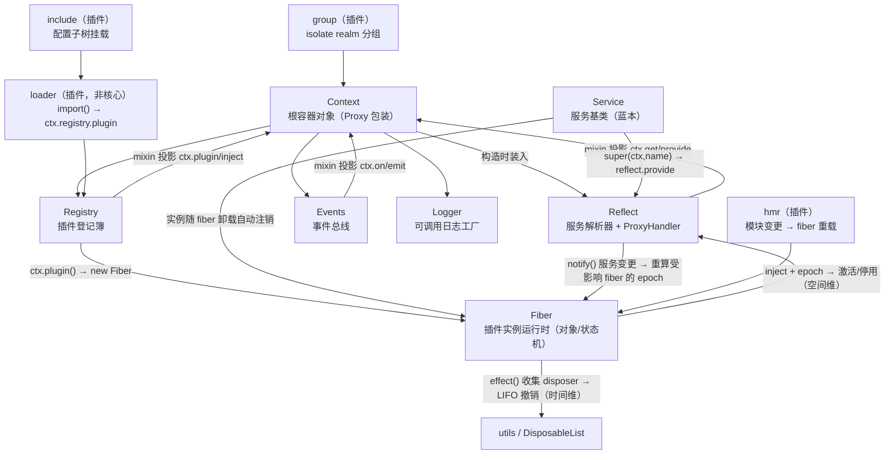

# Cordis 框架研究（核心）

> 记录：2026-08-21 · 2026-09-06 修订：剥离工程化旁支（Bun 构建 / 异构语言桥 / Rust 重写 /
> Recursive Cordis → `cordis-engineering-feasibility.md`），本文专注 **Cordis 核心机制**；
> 新增 §3.2 七名词的编程语言形态分类、§4 Fiber 运行全景、§5 时空再审视、§6 TS 机制答疑
> （均对 vendored 源码一手核验）。
> 一手核验：vendored `@deepseek-ai/cordis` 4.x（本地 4.0.1）源码 +
> `github.com/cordiverse/cordis`（6770★）+ `github.com/cordiverse/paper`（2532★）+
> dsh 官方 docs（`master` @ 2026-08-19）+ dsh `vendor/README.md`。
> 本文是 Cordis 单侧研究（与 Dash 解耦后的文档；Dash 侧见 `dash-research.md`；
> 工程化旁支见 `cordis-engineering-feasibility.md`；JS/TS 语言基础伴生讲义见
> `js-ts-language-fundamentals.md`）。

---

## 1. 总览与时空可组合性

### 一句话

**Cordis 是"时空可组合性的元框架"（A Meta-Framework of Spatiotemporal Composability）**：
一个 TypeScript 插件框架，把经典类型论的 *effect/coeffect* 对偶落成两套运行时机制——
**可逆效应（Revertible Effects，时间维）** 与 **反应式余效应（Reactive Coeffects，空间维）**，
使插件"插得上也拔得下、依赖变化自动激活/停用"，全程免重启进程。

### 血统与时间线

- 作者 **Shigma（施一凡）**，Koishi 聊天机器人框架作者（2020-01 首版）。2023 年已写
  《可逆的插件系统》设计文（koishi.chat cookbook）——论文雏形，非学术论文。
- **2026-08-13**：论文 + dsh 开源同日。论文 *A Programming Paradigm for Spatiotemporal
  Composability*，DeepSeek × 北大，88 页，`github.com/cordiverse/paper`（"Draft of August
  13, 2026"，active revision）。
- `Cordis` = 拉丁语"心"；Koishi 的一切都从 Cordis 开始。全程先工程后理论，DeepSeek 参与
  是 2026 年的事。

### 理论支柱：effect / coeffect 对偶 → 运行时机制

| 维度 | 论文概念 | 工程语义 | 解决的问题 |
|---|---|---|---|
| **时间维** | **Revertible Effects** | 每次上下文修改配显式逆函数，叠成撤销链；卸载时反向执行 | 插件"插得上拔不下"（状态残留、伤及运行中组件） |
| **空间维** | **Reactive Coeffects** | 组件声明依赖 → 自动拓扑编排；依赖齐→ACTIVE，缺→INACTIVE；提供者撤走→依赖者先停；回归→自动恢复 | 补丁式依赖维护 / 循环依赖 / 手写编排代码 |

并统一 effect context 与 coeffect context 为**单一 context 类型**（这即"编程范式"），再组合成
**component（组件）**，给出**动态组合的演算**，其元理论把时空可组合性从单组件推广到整个
交错组件系统。

### 作为代码的实现（源码级取证）

核心包 9 个源文件（`context/service/fiber/events/registry/reflect/logger/utils/index`，
**实测 2693 行**）。四个构件落地时空可组合性：

- **`Context`** = 运行时代理：一个 JS 对象（类实例），但被 `new Proxy()` 包装——属性读取
  不在编译期绑定，而是读取那一刻走服务解析器（`ctx.tools`/`ctx.llm` 由服务名解析当前活跃
  提供者，非 import 具体实现）。详见 §3.2 与 §4.1。`extend()`/`isolate()`/`intercept()`
  创建作用域子 context。
- **`Fiber`** = 一个插件应用的运行时（实例记录 + 状态机）。持有 `_disposables`
  （DisposableList）、`inject`（依赖声明）、`store`（已解析实现）、`state`（FiberState）、
  `epoch`（依赖满足度签名）。
  - **时间维** `Fiber.effect(execute, label)`：`execute` 立即执行，产出 disposer 被收集；
    disposer 被调 **或** fiber 卸载时，disposers **逆注册序（LIFO）** 执行（
    `disposables.splice(0).reverse()`）。
  - **空间维** `inject` + `_checkImpl` + `_refresh` + `epoch`：遍历每个依赖，任一缺失 →
    `epoch=INACTIVE` → `_unload()`（停用）；全部存在 → `epoch=':uid:uid...'` → `_reload()`
    （激活）；**提供者 fiber uid 变化** → epoch 变化 → 依赖者先 unload 再 reload。
- **`Service`** = 服务基类：构造函数 `super(ctx, name)` 即 `ctx.reflect.provide(...)` 注册，
  随所属 fiber 卸载自动注销。
- **`EventsService`** = 事件总线，五种派发模式 `emit/parallel/serial/bail/waterfall`
  （waterfall 是 around-middleware，`next()` 委派、不调则短路）。

### 生产验证与自认局限

Koishi：4 年、4000+ 社区插件、作者互不相识，唯一协调机制 = 反应式余效应；切存储后端 /
重连 IM 适配器时仅依赖变化的插件重激活。论文自认局限：仅 Koishi 一生态验证、仅 TS 单语言
数据、无与其他替代架构的直接对比。

---

## 2. 非特权核心（No Privileged Core）

### 你的理解的校验（逐点）

> "基底 binary 可以看作一个入口"

✅ 精确。`dsh` 这个 binary 是 `apps/cli` 产出的 `lib/bin.js`，官方自述为 **"a thin
self-executing composition"**（薄的自执行组合）——它只做一件事：调 `dsh-app-boot` 的
`boot()`。

> "核心自己自举（bootstrap）为一个 plugin"

⚠️ 半对。**框架基底（Context + reflect/registry/events/logger 四服务）不是 plugin，它就是
框架本身**——不是"自举成 plugin"，而是"进程里那个被 `new Context()` 造出来的根容器"。
真正被"自举/挂载"的是 **App 的插件树**（dsh 的 ~195 个插件），它们经 Loader 从
`dsh-base` 的 `cordis.patch.yml` 逐行 insert 到根 context 上。

> "如果你基于 Cordis 写了另一个 plugin，让它自举为一个核心也是可以的"

✅ 对，且措辞可更准：你不是"写一个 plugin 当核心"，而是**写一个 Cordis App（一个插件树 +
一个薄 bin）**，它与 Dash 地位完全平等。Dash 只是"基于 Cordis 的 App 特例"。

> "Dash 第一个自举的 plugin 就成了核心"

⚠️ 需要修正。**没有"第一个插件成为核心"这回事**。"no privileged core" 的准确含义是：
**框架之外没有任何硬编码的、不可替换的模块**。看起来像"核心"的东西（`session`/
`system-prompt`/`tools`/`agent`/`agent-loop` 这六件"脊柱"）**全是 `dsh-base` 的
`cordis.patch.yml` 里的普通插件行**，可被上层 patch 按 id 整行替换。所谓"核心"只是
"恰好提供了别人 inject 的基础服务的那个插件"，并非特权位。

### Bootstrap 链（源码取证）

```
dsh 二进制（lib/bin.js，薄壳）
  └─ boot(binName, configPath, ...)         # dsh-app-boot
       ├─ new Context()                     # 根容器（框架基底，非 plugin）
       ├─ 注册 cordis:include + cordis:group builtins
       ├─ 安装 Loader
       ├─ mountRootInclude(...)             # 挂载 cordis.yml 配置树
       │    └─ 逐层叠加：bundle patch 层 → profile patch → home patch → --patch
       │         └─ 每行 = 一个 plugin（含 dsh-base 的 agent-loop 等"核心"）
       ├─ assertEntriesLoaded / Activated    # 全部解析/激活，否则 fail loud
       └─ 返回根 Context
```

**关键证据**：`dsh-app-boot` 的 `boot()` 注释明言 "Create the root context, install Loader,
... mount and await the include tree ... return the root context"。核心（框架）与 App
（插件树）的边界就在 `new Context()` 这一行：它之上全是可 patch 的插件，它本身才是唯一的
"内核"。

---

## 3. 架构结构测绘

### 3.1 Monorepo 包结构（`cordiverse/cordis`，9 包）

```
cordis/
└── packages/
    ├── core/            → 发布为 `cordis`：Context/Fiber/Service/Events/Registry/Reflect/Logger
    ├── loader/          → `@cordisjs/plugin-loader`：声明式配置加载（YAML/JSON 行 → 插件树）
    ├── include/         → `@cordisjs/plugin-include`：配置子树挂载 + `!!js` 表达式
    ├── hmr/             → `@cordisjs/plugin-hmr`：热模块替换（保存 → 仅重应用该插件）
    ├── group/           → `@cordisjs/plugin-group`：插件分组（isolate realm）
    ├── timer/           → `@cordisjs/plugin-timer`：定时服务
    ├── create/          → 脚手架（Node 22+）
    ├── logger-console/  → 控制台日志后端
    └── utils/           → 共享工具
```

只有 `core/` 是框架本体；其余全是**用框架 API 写的普通插件**（"关于插件的插件"，见 §3.4）。

### 3.2 核心七名词的编程语言形态分类（答疑）

**分类标准**（你的框架，予以保留）：**对象 = 名词**（内存里的一坨数据+行为）；
**函数 = 动词**（可独立调用的可执行体）；**方法 = 挂在对象下的可执行函数**
（如 `context.load`）；**类 = 蓝本**（生产对象的模板，本身也是对象）。

先给结论，再逐项展开：

| 名词 | 源文件 | 运行时语言形态 | 一句话本质 |
|---|---|---|---|
| **Context** | `context.ts` | **对象**（类实例，且被 Proxy 二次包装） | 根容器 + 开放命名空间；一切挂载点 |
| **Fiber** | `fiber.ts` | **对象**（类实例，每个 `ctx.plugin()` 调用一个） | 一个插件实例的运行时记录（状态机 + 撤销清单 + 依赖签名） |
| **Service** | `service.ts` | **类**（abstract 蓝本）→ 实例是**对象** | "以服务形式挂上 ctx 的对象"的基类模式；构造即注册 |
| **Events** | `events.ts` | **对象**（`ctx.events`，普通类实例） | 事件总线；`on/emit/parallel/serial/bail/waterfall` |
| **Registry** | `registry.ts` | **对象**（`ctx.registry`，普通类实例） | 插件登记簿（`Map<callback, Runtime>`）；`ctx.plugin/inject` 的本体 |
| **Reflect** | `reflect.ts` | **对象**（`ctx.reflect`）+ **static ProxyHandler** | 服务解析器 + 代理陷阱层；让 Context 成为"运行时代理"的那个机制 |
| **Logger** | `logger.ts` | **对象**（**可调用对象**：函数+对象混合体） | 日志工厂；`ctx.logger(name)` 调用服务本身，返回具名 Logger 门面 |

要点先行——**七个全是"名词"（对象/类），没有一个是独立函数；你感受到的所有"动词"
（`ctx.plugin()`、`ctx.on()`、`ctx.effect()`）都是方法，且是"投影出来的方法"**（见下）。

**两级视图（把"类"与"实例"分开说——你的第二次逼近成立）**：`Context` 是类（蓝本），
`new Context()` 产出的 `ctx` 才是实例（对象）；`Fiber` 是类，每次 `ctx.plugin()` 产出一个
Fiber 实例（注意：`ctx.plugin` 本身是方法——RegistryService 投影，它的**返回值**才是那个
Fiber 实例）；`Service` 是类，由提供方插件 new 出服务实例。⚠️ 术语更正：`new`/`extends`/
`instanceof` 是 JS 语言关键字，但 `extend()`/`isolate()`/`intercept()` **不是保留字**——
它们是 Cordis 作者写在 Context 类上的普通方法，恰好起了这些名字。对类的"原操作"只有
语言关键字那几个；其余全是类自定义方法。
#### (a) Context：一个对象，而且是"被代理的对象"

用 JS 语言说清楚：

1. `class Context` 是一个类（蓝本）。`new Context()` 产出实例——这就是你说的"一个对象"。
2. 但构造函数最后一行 `return self`，其中 `self = new Proxy(this, ReflectService.handler)`
   （`context.ts` 构造函数）。**JS 的 `Proxy` 是语言内置的"拦截器"**：包装后，外界对 ctx
   的一切属性读写都先经过 `ReflectService.handler` 的 `get`/`set`/`has` 陷阱函数。
3. 陷阱的逻辑（`reflect.ts` handler.get）：自身属性（`events/logger/registry/reflect/root`
   等）直通 → 声明过的 accessor 走 accessor → 其余属性名被当作**服务名**，沿 fiber 链向上
   查询"当前作用域内谁是这个服务名的活跃提供者"（尊重 isolate 作用域）→ 查不到就抛
   `cannot get property "..." without inject`。

所以"**运行时代理**"的准确含义是：**属性读取不在编译期绑定到具体实现，而是在读取那一刻
由运行时查询服务登记表来解析**。你的理解"它是一个对象、所有插件/服务都挂在这个对象下面"
对了前一半（挂载确实以此为根），但"挂"不是静态属性赋值——服务是登记进 `ReflectService`
的 store，经 Proxy 按名动态解析。这带来关键后果：**同一个表达式 `ctx.llm` 在不同时刻可以
解析到不同对象**（提供者换人、服务热替换），这是"免重启"的语言层基础。

另一个易误解点：ctx 上看起来"什么方法都有"（`ctx.on`/`ctx.plugin`/`ctx.get`/`ctx.effect`），
像一个大杂烩上帝对象。实际上 **Context 类自身只定义了三个方法：`extend()`/`isolate()`/
`intercept()`**（外加 `Context.is()` 等静态成员）。其余所有"方法"都是四个内建服务的方法经
`ctx.mixin()` **投影**到 ctx 命名空间上的 accessor（见 (d)-(f)）。

**符号键的跨副本根基**（2026-09-07 补，外部分析校验时发现）：框架内部符号**全部**用
`Symbol.for('cordis.*')`（全局注册表符号，utils.ts L50–73）定义——同一进程装入两份
cordis 副本（vendored + npm）时符号仍相等，互操作不碎；`Context.is` 品牌、
`[symbols.isolate]` 等内部槽全靠它。类型侧用 `as typeof Context.effect` 把值拴到类静态
声明的 `unique symbol`（unique symbol 的核心用途：让 symbol 能做 interface 计算键）。
详见伴生讲义 §20。

#### (b) Fiber：一个对象——插件实例的"运行时档案 + 状态机"

不是函数、不是方法，是纯对象（类实例）。每次调用 `ctx.plugin(插件, 配置)` 就 `new Fiber(...)`
一个（`registry.ts` L296）。它记录：

- `uid`（registry 发的唯一序号；根 fiber 为 0）、`ctx`（该插件专属子 context）、
  `config`（校验后配置）、`inject`（依赖声明表）、`store`（已解析的服务实现快照）、
  `state`（PENDING/LOADING/ACTIVE/FAILED/DISPOSED/UNLOADING 六态）、
  `_disposables`（disposer 清单）、`_runner.epoch`（依赖满足度签名）。
- 它自己的方法：`effect()`（登记可撤销效应）、`restart()`、`update()`、`await()`、`dispose`。

**真正的"动词"不是 Fiber，而是它包裹的插件回调**：`_execute` → `runtime.callback(ctx,
config)`（函数插件直接调用 / 类插件 `new`）。Fiber 是这个动词的**执行上下文与档案**——
你的"Fiber 本质上是一个插件实例的运行时"这句判断完全成立。

#### (c) Service：一个类（蓝本）——"自我登记的对象"模式

`abstract class Service` 是给**插件作者**继承的基类。子类构造函数里 `super(ctx, 'name')`
做两件事：把实例挂为 `this.ctx`、调用 `ctx.reflect.provide(name, this)` **把自己登记为
该名字的服务提供者**——随所属 fiber 卸载自动注销。所以 Service 是一个**模式**：
"构造即登记、随宿主撤销"的对象。它不是函数也不是方法；它的实例是对象（特殊情形：声明了
`[Service.invoke]` 的服务实例会被包装成**可调用对象**——函数与对象的混合体，如
`ctx.logger('name')` 就是"调用服务对象本身"）。

注意区分：**四个内建服务（Events/Registry/Reflect/Logger）并不继承 Service，也不是插件**
——它们由 `new Context()` 构造函数直接 `new` 出来装进根容器，属于框架基底。`Service` 基类
是给此后挂上来的东西用的（Loader 就是 `Service` 的子类，见 §3.4）。

同时 **Service 也不是 Context 的子类**：`abstract class Service` 不 `extends Context`，
TS 也没有"类里嵌类"这种结构——它通过构造参数 `(ctx, name)` **持有**一个 ctx 引用
（存为 `this.ctx`），是**组合（has-a）而非继承（is-a）**。dsh 实证：`AgentRegistry
extends Service`（`agents`/`subagents` 提供者）、`LlmRuntime extends TypertRemoteService
extends Service`（`llm` 提供者）。

#### (d) Events：一个对象——事件总线

`export class EventsService`（普通类），实例挂为 `ctx.events`。持有一张 `_hooks` 表
（事件名 → 监听器数组）。核心方法 `on/once/emit/parallel/serial/bail/waterfall`——这七个
方法经 `ctx.mixin('events', [...])` 投影为 `ctx.on(...)` 等（`reflect.ts` 构造函数里）。
事件监听器随登记它的 fiber 卸载而自动移除（又一个 effect）。

#### (e) Registry：一个对象——插件登记簿

`export class RegistryService`（普通类），实例挂为 `ctx.registry`。内部一张
`Map<插件回调函数, Plugin.Runtime>`（Runtime = `{name, callback, fibers, Config}`，同一插件的
多次挂载共享一条 Runtime 记录、各有一个 Fiber）。核心方法 `plugin()` / `inject()`——前者就是
"挂插件"的动词入口：校验形状 → 建/查 Runtime → `new Fiber(...)`。经 mixin 投影为
`ctx.plugin()` / `ctx.inject()`。

#### (f) Reflect：一个对象 + 一段静态 ProxyHandler——服务解析器（最核心的一个）

`export class ReflectService`（普通类），实例挂为 `ctx.reflect`。它持有：

- `static handler`：那个 Proxy 陷阱对象——**Context 之所以是"运行时代理"，机制全在这里**；
- `store`：服务实现登记表 `Dict<Impl>`（Impl = `{name, fiber, value, check}`，按 isolate
  符号键分作用域）；
- `props`：ctx 属性定义表（service / accessor 两类）；
- 方法 `provide/get/set/accessor/mixin/notify`——`notify` 是空间维的**心脏**：某服务变更时
  遍历 registry 里所有 inject 了该服务的 fiber，逐个重算依赖与 epoch（见 §4.3）。

⚠️ 命名陷阱：它与 JS 内置的 `Reflect` 全局对象**无关**。"reflection" 取元编程之意——
拦截属性访问、把"名字 → 实现"的解析变成运行时数据。Plugin Include 等机制确实经它做服务
解析，但 include 的主体机制是配置组合（见 §3.4 的修正）。

#### (g) Logger：一个可调用对象——日志工厂

`LoggerService` 实例被 `createCallable` 包装成**可调用对象**（函数+对象混合体）：调用
`ctx.logger('my-plugin')` 就是调用服务对象本身（调用体 = `LoggerService[symbols.invoke](name)`，
`logger.ts`），返回一个具名 `Logger` 门面对象
（`error/info/warn/debug` 四个方法 + 着色/格式化）。`Logger` 门面也是对象；exporter 后端
（如 logger-console 包）另算插件。

#### 合起来的图景："方法"是投影的错觉

你在 ctx 上调用的每个"方法"，真实归属是：

| 你写的调用 | 真实本体 | 投影机制 |
|---|---|---|
| `ctx.on/once/emit/parallel/serial/bail/waterfall` | `ctx.events.*`（EventsService 方法） | mixin accessor |
| `ctx.plugin(...)`, `ctx.inject(...)` | `ctx.registry.*`（RegistryService 方法） | mixin accessor |
| `ctx.get/set/provide/accessor/mixin` | `ctx.reflect.*`（ReflectService 方法） | mixin accessor |
| `ctx.effect(...)`, `ctx.runtime` | `ctx.fiber.*`（Fiber 的成员） | mixin accessor |
| `ctx.extend/isolate/intercept` | `Context` 类自身的方法 | 原型链 |
| `ctx.llm` / `ctx.tools` / 任何服务名 | ReflectService.store 里的当前活跃实现 | Proxy get 陷阱 |

**运行时用 Proxy + mixin 把五个服务的表面"压平"成一个 ctx 命名空间；编译期用声明合并把
五个模块的类型表面合并进一个 `Context` 接口（见 §6）——两层是精确对称的。**

#### 嵌套与递归：两种"套娃"，别混为一谈

你的"可以无限嵌套下去"直觉在**运行时**成立，但要区分两层：

1. **对象图嵌套（普通 JS，框架不管）**：`ctx.agents` 返回的对象有自己的方法，方法又
   返回 session/实例对象……任何对象图都能这样套，与 Cordis 无关。
2. **框架级递归（Cordis 的分形结构）**：框架原语在**每一层**都可用——任何插件/服务的
   代码都能再 `ctx.plugin()`（fiber 树加深）、`ctx.extend()/isolate()`（context 链延长）、
   `ctx.provide()`（服务图加深），且每一层都自动获得同样的 effect 收集与 epoch 生命周期。
   Loader 挂 dsh 插件、dsh 插件再挂 per-session 子插件，就是这棵树在真实 App 里的深度。

类层面**没有**嵌套：TS 的类都是模块级的，`Service` 不定义在 `Context` 里面，也不继承它；
"嵌套"全部发生在**运行时对象图**（fiber 树 + context 原型链 + 服务引用）这一侧。

### 3.3 七名词互动图



### 3.4 插件包层：loader / include / hmr / group——"关于插件的插件"

你的理解框架**成立**：核心定义完 7 个名词后即自包含；loader/include/hmr/group 这些包
（发布名 `@cordisjs/plugin-*`）都是**用核心 API 写的普通插件**，解决"非核心的外来插件怎样
融入根容器"。逐个校验（以 dsh vendored 的 `@deepseek-ai/cordis-plugin-loader` 一手核验）：

| 包 | 你的理解 | 校验与精确化（源码锚点） |
|---|---|---|
| **loader** | 扫描非核心插件、有就加载进来；互动根容器是 Context，对应方法是 Registry | ✅ 精确。`Loader` 类**本身是 Service 子类**：构造时 `ctx.reflect.provide('loader', this)`——装载器自己也是一个服务插件（dsh 里由 `dsh-app-boot` `ctx.plugin(Loader)` 挂载为 `cordis:include` 内建）。它读配置树（YAML/JSON 行）→ 每行一个 `Entry` 节点 → `Entry` 里 `tree.import(name)` 动态 `import()` 模块 → `unwrapExports()` 归一 → **`ctx.registry.plugin(plugin, config)`**（`config/entry.ts` L296）——最后一跳正是你说的"对应的方法就是 Registry" |
| **group** | 就是一个子 Context；核心里 isolate 等本质也是子 Context | ✅ 成立。核心 `Context.isolate(name, label)` 本来就产子 context（`extend()` 出原型链子对象 + 独立 isolate 映射）；group 包在这之上做**配置化封装**：`EntryGroup` 管一组子条目，`Realm`（LocalRealm/GlobalRealm）给服务名分配符号作用域——即"一组插件在独立 realm 里互见、与外界隔离"。所以：**子 Context 是核心机制，group 是它的声明式糖** |
| **include** | 依托核心里的 Reflect 实现 include | ⚠️ 需修正主体：include 解决的是**配置组合**——把外部配置子树（另一份 YAML、`!!js` 表达式求值）并进当前插件树，然后把实际加载委托给 Loader → Registry。它依托的主干是 **Context 的作用域机制（`extend`/`intercept`）+ Registry/Loader**；Reflect 只在最后的"服务解析"一环出场（任何服务消费都经它，但这不是 include 的特性）。一句话：**include = 配置层的组合子；服务解析层的组合子是 Reflect** |
| **hmr** | （未展开） | 模块文件变更 → dispose 受影响 Runtime 的 fibers → 重新 import + `ctx.plugin()` 重挂（loader 源码注释"plugin hmr: delete(plugin) -> runtime dispose -> fiber dispose"）。核心侧对应原语就是 `Fiber.restart()` / epoch 重算——hmr 没有自己的新机制，纯调度 |

**统一图景**（你的表述可直接采用）：App 的 entry point 是 Core（`new Context()` 完成基础
准备——定义七个名词、装入四服务、造根 fiber）；此后一切都以插件形式从根容器长出来：
Loader 负责"发现并加载"，include 负责"配置怎么拼"，group 负责"挂到哪个作用域"，hmr 负责
"变了就重挂"。**它们互相也只是对方的插件/服务，无一是特权**。

### 3.5 进程内约束（TS-only，Node ESM）

- `cordis/package.json`：`"type": "module"`、`"main": "lib/index.js"`；依赖仅
  `@standard-schema/spec` + `cosmokit`——**零 native addon、零 WASM、零 child_process**。
- 插件入口只有三种形状：`Function(ctx, config)` / `Constructor` / `Object{apply}`，必须求值
  为 JS 可调用对象（`RegistryService.resolve()` 只认这三类）。
- 插件加载：`tree.import(specifier)` → `unwrapExports()` → `ctx.registry.plugin(...)`。
  `ModuleFormat = 'builtin'|'commonjs'|'json'|'module'|'wasm'`（仅 Node loader 格式）。

> 打包编译（换 Bun）、异构语言桥、Rust 重写等工程化可行性研究已剥离至
> `cordis-engineering-feasibility.md`。

---

## 4. 运行全景：一个 Cordis App 从启动到自愈（答疑）

### 4.1 启动链与"控制权移交"的准确位置

```
Node 进程启动（bin 薄壳）
  → new Context()
       ├─ 造 Proxy 包装的根 ctx 对象
       ├─ 构造四个内建服务：reflect → registry → events → logger
       │    （ReflectService 构造函数顺手把四服务的方法 mixin 投影到 ctx 上）
       └─ 造根 Fiber（uid=0，无 runtime，execute=空函数，天生 ACTIVE）
            ——根 fiber 就是"框架自身的运行时档案"，dispose 它 = 重启整个插件树
  → app-boot 挂 Loader 插件（ctx.plugin(Loader)，Loader provide 'loader' 服务）
  → Loader 读配置树，逐行：
       ctx.registry.plugin(插件模块, 行配置)
         → new Fiber(...)（PENDING，专属子 ctx = parent.extend({fiber})）
         → 逐个 inject 名字 _checkImpl() 查依赖 → _refresh() 算 epoch
  → 依赖齐（epoch 非 INACTIVE）→ _reload() → _execute()
       → runtime.callback(this.ctx, this.config)   ← ★ 控制权移交时刻
            （函数插件直接调用；类插件 new 之；此后跑的全是插件作者的代码）
  → 插件代码里的 ctx.on()/ctx.provide()/... 每一笔都被记为该 fiber 的 effect
```

你的模型"entry point 是 Core → Core 做基础准备 → 之后交给 Fiber 去运行 App 实例 → 每个
Fiber 运行起来就是把控制权交给该插件的代码"——**成立**，只需补一处精确：移交不是构造
Fiber 时发生的，而是 Fiber 的依赖检查通过、`_reload()` 执行 `_execute` 调到
`runtime.callback(ctx, config)` 那一刻。Fiber 创建后可能长期停在 PENDING（依赖未齐，
代码一行不跑）；依赖永远不齐就永远不跑。

### 4.2 两层依赖检查：静态层在框架外，动态层在框架内

你的两分法正确，边界再钉死一点：

1. **静态层（Cordis 管不着，也不管）**：npm 包依赖、TS `import`、IDE 类型检查——发生在
   写码/构建期，由 Node 模块系统与 tsc 解决。Cordis 对此的唯一约定是：模块默认导出必须是
   三种插件形状之一。
2. **动态层（Cordis 的领地）**：`inject` 声明（插件静态写明"我需要哪些服务名"，**注意：
   inject 声明的求值发生在插件加载前，但它检查的东西——服务的在场性——是运行时状态**）。
   `import` 绑定"代码在哪"，`inject` 绑定"运行时和谁耦合"：前者编译期解析一次就死；
   后者每次服务变更都重查。这就是为什么换实现可以免重启——耦合点是名字，不是引用。

补充一个中间工具：`ctx.get(name, strict=false)` 可以不声明 inject 就"偷看"服务（拿不到
得 undefined，不会抛错）——用于可选依赖；但偷看不会建立响应关系，服务来了不会唤醒你。

### 4.3 Effect 收集与撤销（时间维机制，源码级）

**"Effect 检查器"的准确身份：不是一个独立组件，而是 Fiber 内建的收集器**——
`_disposables`（DisposableList）+ `effect()` API + LIFO 撤销约定。没有第七个名词，它就是
Fiber 这个名词的一组方法。

- **登记**：`ctx.effect(execute, label)`（投影自 `ctx.fiber.effect`）。`execute` **立即执行**；
  其返回值被收集为 disposer——接受四种形状：单个函数 / Promise<函数> / 迭代器 /
  异步迭代器（**生成器写法支持流式登记**：每 yield 一个 disposer 立即生效，长生命周期任务
  可边跑边登记）。框架自身的一切上下文修改都走这条路：`ctx.on` 返回的注销函数、
  `ctx.provide` 的注销、`ctx.mixin` 的拆除……全是 effect。
- **数据结构**：你猜"清单，或者可能是一个树状结构"——**两层都对**：运行时是**平面列表**
  （DisposableList，Map 保序去重）；每个 disposer 携带 `EffectMeta`（label + children）构成
  **诊断树**（`fiber.getEffects()` 拉出来看，就是运行时 effect 的账本）。
- **撤销序**：LIFO 有两处一手实证——单 effect 撤销 `disposables.splice(0).reverse()`
  （`fiber.ts` effect 内部）；fiber 整体卸载 `DisposableList.clear()` → `values.reverse()`
  （`utils.ts`）。语义：**后建立的依赖先拆**（典型如先拆"用连接的回调"再拆"连接本身"，
  逆序保证不会拆到还在用的东西）。
- **单次性**：disposer 调第二次是 no-op；async disposer 会被 await。

### 4.4 epoch：依赖满足度签名与"迁移"的真身（空间维机制）

把你的描述逐句对到源码：

| 你的表述 | 源码机制 |
|---|---|
| "用 inject 语法，实际运行起来时它看到就去检查" | 服务登记/注销/换值 → `ctx.reflect.notify([名字])` → 遍历 registry 全部 Runtime 的全部 fiber，凡 inject 了该名字的：`fiber._checkImpl(名字)`（重新解析实现进 `_store`，含可用性谓词 `check()`）→ `fiber._refresh()` |
| "依赖签名（epoch 检查）" | `_refresh()` 重算签名：遍历 inject 名字，任一缺失 → `epoch = INACTIVE`（字符串哨兵）；否则 `epoch = ':' + 提供者1.fiber.uid + ':' + 提供者2.fiber.uid ...`——**把"我依赖谁的哪一代"压缩成一个字符串指纹** |
| "不存在 → inactive → 动态清理/迁移出去" | `_setEpoch(新签名)` 与旧签名比较：变化则驱动状态机——`INACTIVE → 有效` = `_reload()`（执行插件回调）；`有效 → INACTIVE` 或 **uid 变了**（':3'→':7'，提供者换人）= `_unload()`（LIFO 跑光全部 disposer），卸完发现签名又有效则自动 `_reload()`。⚠️ 精确化：被"清理"的不是依赖声明（inject 表原样保留），而是**依赖者的全部副作用被撤销、状态回到 PENDING**；提供者回归（无论同一 fiber 复活还是新 fiber 顶上）后，依赖者**从头重放** apply——插件代码被重新执行一遍，拿到的是新提供者的引用。所谓"迁移"= **卸载-重放循环**，不是把对象搬家 |
| "如果存在就执行 apply / 还在的就继续" | 对，且更弱：Cordis 不做增量更新依赖者——只要提供者 uid 变了就整 fiber 重放（哪怕新旧实现 API 兼容）。这是"简单粗暴但正确"的取舍：重放成本换来了不用写迁移代码 |

**闭环**：提供者注销自身也是 effect（`ctx.provide` 的 disposer 里 `delete store[key]` +
`notify`），所以"拔插头"这个动作本身可逆、可追溯——时间维与空间维在此咬合：
**空间维的每次图变化，都通过时间维的撤销/重放机制落地**。

---

## 5. 时空再审视："其实只有一个时间维"？——对一半，另一半要说准

你的命题："它实际运行起来其实只有一个时间维，只不过把空间维的'可组合性'（依赖、调用）
放在动态运行时去自愈。"

**判定：执行层面的观察完全正确；但"空间维消失了/只是自愈"的推论要修正——空间维没有
消失，而是换了存在形态：从"构建期静态结构"变成"运行期可增量重算的数据"。**

论证：

1. **执行确实只有一条时间线**。单进程单线程事件循环，一切（加载、provide、notify、
   unload/reload、disposer）都排布在同一条因果链上。没有第二条执行流，"时间维是唯一的
   执行维度"成立。
2. **但空间维作为数据真实在场**，且不可归约：
   - `inject` 边集合（谁声明依赖谁）——决定 notify 波及谁；
   - `store` + isolate 符号作用域——决定"谁能看见谁"（祖先可见、兄弟不可见、realm 隔离），
     这是**纯空间规则**，不随时间演化；
   - `epoch` 本身就是空间状态的指纹——如果空间维不存在，这个签名无从算起。
3. **准确的分工**（一句话版）：
   **时间维是机制（怎么撤销、怎么重放），空间维是数据（对谁、按什么拓扑）；
   自愈 = 空间数据的一次变更事件，驱动时间维机制重放受影响的子图。**
4. 与传统框架对比即见差异所在：NestJS/Angular 的空间维（DI 图）在构建/启动期定死，
   运行期只是查询；Cordis 把这张图**物化为运行时数据**（store/epoch），任何一次变化都能
   增量重算。类比：React 把 UI 从命令式操作变成 `UI = f(state)` 的派生数据；Cordis 把
   **插件激活**变成 `激活 = f(依赖图)` 的派生状态——插件作者只写正向 apply + 隐式逆
   （effect 收集），"何时调用"归框架。

所以更精确的说法不是"只有一个时间维"，而是：**"空间维被数据化，时间维被机制化，两者
在事件循环上合流。"** 这也正是论文说"时空可组合性"而不说"运行时依赖注入"的原因——
它主张的是两维的**乘积**（每次空间组合都可逆），不是单维。

---

## 6. TypeScript 机制答疑：interface / class / export / d.ts

读 `lib/types/context.d.ts` 时产生的三个困惑，逐个解开：

### 6.1 `interface Context` 与 `class Context` 出现两次——声明合并（Declaration Merging）

- TS 里 **class 既是值也是类型**：`class Context` 定义了运行时的构造函数+原型（值的一面），
  同时隐式定义了"实例的形状"（类型的一面）。
- **同名 interface 会与 class 的实例类型合并**：`export interface Context` 给这个类型追加
  成员（`events`/`logger`/`root`/symbol 键……）。两个声明不冲突，是**叠加**——这是 TS 的
  合法特性，不是重复定义。
- 于是 `Context` 的完整类型 = class 自身成员（`extend/isolate/intercept`）∪ interface
  写明的四服务属性 ∪ **其他模块后续追加的成员**。

"追加"的通道就是你在 `fiber.ts`/`reflect.ts`/`registry.ts`/`events.ts` 开头看到的：

```ts
declare module './context.ts' {
  export interface Context {
    fiber: Fiber          // fiber.ts 追加
    get/provide/mixin...  // reflect.ts 追加
    plugin/inject...      // registry.ts 追加
    on/emit/waterfall...  // events.ts 追加
  }
}
```

这叫**模块增强（module augmentation）**：每个服务模块把"我投影到 ctx 上的方法"同时写进
Context 类型。**这与运行时的 mixin/Proxy 机制严格对称**——运行时五个服务的表面被压平成
一个 ctx 对象；编译期五个模块的类型表面被合并成一个 Context 接口。所以 Context 的类型是
"开放命名空间"（谁都能往里加成员），和它的运行时身份（开放命名空间，谁都能 provide）同构。

### 6.2 `.d.ts` 里的 `declare` 与 `export` 给谁

- 你读的是 `lib/types/context.d.ts`——**类型声明文件**，构建时由 tsdown/tsc 从 `src/*.ts`
  生成，随 npm 包发布。`package.json` 的 `types` 字段把 tsc/IDE 引到它。
- `.d.ts` 里的 `declare` 意思是"**这里只有类型合同，没有实现**"——实现在旁边的
  `lib/*.js` 里。它是给**编译器和 IDE** 的接口文档，不是给引擎的代码。
- **`export` 的受众不是 Node 引擎，是"导入方"**：其他 TS/JS 模块的 `import` 语句、
  tsc（拿它做类型检查）、IDE（拿它做补全）、bundler（拿它做模块图）。模块系统解决的是
  **模块之间的可见性**（我暴露什么名字给你 import），引擎只是最终执行编译产物。
- **类型擦除**：`export interface` / `type` / `declare` 这些纯类型导出**编译后不存在**，
  生成的 JS 里一个字节都不留。只有值导出（`export class Context`）留下运行时实体
  （构造函数+原型）。所以"Context 是不是一个类型？"——**作为类型它是（interface 合并后的
  开放类型）；作为值它也是（class）**；运行时只有后者存在。
- Node 引擎的角色澄清：引擎（V8）见到的是编译后的 JS（现代 V8 是 JIT 编译执行，不是纯
  解释，但"先翻译再执行"的直觉可用）。Node 22 确实能直接跑 `.ts`（type-stripping，本仓
  dsh 的 PTC `run_code` 就在用），但那也是**先把类型剥掉再执行**——类型同样不进引擎。

### 6.3 一表总结：同一行代码在四个视角下的身份

以 `export class Context` 为例：

| 视角 | 它是什么 |
|---|---|
| TS 类型系统 | 值类型（构造函数类型）+ 实例类型（与同名 interface 合并、可被模块增强） |
| tsc / IDE | 从 `.d.ts` 读合同，检查 import 方的用法 |
| 编译产物 JS | 一个普通的 class（构造函数 + prototype），Proxy 包装发生在构造函数内部 |
| 运行时（V8） | 你 `new Context()` 拿到的那个**被 Proxy 包装的对象**——即 §3.2(a) 的根容器 |

---

## 7. 同类竞品调研

真正**同时**达到时间维（运行时保证的逆函数撤销）+ 空间维（响应式依赖自动激活/停用）的，
只有 **Cordis、其直系祖先 Koishi、经典对手 OSGi**。

| 框架 | 语言 | 时间维 | 空间维 | 免重启卸载 |
|---|---|---|---|---|
| **Cordis** | TS | ✅ `Fiber.effect()` LIFO 撤销 | ✅ `inject`+epoch | ✅ |
| **Koishi** | TS | ✅ `fork.dispose()` 逆序撤销 | ✅ 服务 DI | ✅ 热重载 |
| **OSGi + DS** | Java | ✅* bundle stop + `@Deactivate` | ✅ DS `bind/unbind/reconfigure` | ✅ |
| Effect-TS | TS | ✅ Scope/LIFO finalizers | ❌ 无响应式服务激活 | 部分 |
| VS Code Extension Host | TS | ❌ 手动 dispose，无法原地重置 | ❌ activation 一次性 | ❌ 须宿主重载 |
| Inversify / NestJS / Angular | TS | ❌ OnDestroy 是 shutdown 语义 | ❌ 容器图静态 | ❌ |
| Spring（core） | Java | ❌ Spring-DM 已移除 | ❌ `@RefreshScope` 非响应式激活 | ❌ |
| .NET（MEF/Autofac） | C# | 部分（程序集无法卸载） | 部分 recomposition | ❌ 须 AppDomain |
| Umzug（迁移） | JS | ✅* 仅时间维（up/down） | ❌ | N/A |
| webpack/Tapable、Rollup、esbuild | JS | N/A 构建期 | ❌ | N/A |

**判定**：OSGi 是 Cordis 之前唯一同构的双支柱系统（且免重启卸载）；Cordis 的差异化不在
"有没有"而在**严谨度 + 人体工学**——每个 ctx 变更都带运行时追踪的逆函数、逆序重放（路径无关/
合流性），OSGi 的 `deactivate()` 可靠但依赖作者纪律。Koishi 是直系祖先。Effect-TS 只到时间维；
VS Code 是论文要反对的反例；Nest/Angular/Inversify/Spring/MEF 是空间维或 teardown-only；
Umzug 是相邻的时间维-only；bundler 是构建期。**Cordis 的主张在"类"上不唯一，但在托管语言里
是形式化根基最干净、免重启实现最彻底的一个。**

---

## 来源

- `github.com/cordiverse/cordis`（TypeScript/MIT，`packages/{core,create,group,hmr,include,
  loader,logger-console,timer,utils}`）
- `github.com/cordiverse/paper` —— *A Programming Paradigm for Spatiotemporal
  Composability*（Draft 2026-08-13）
- dsh 仓库 `vendor/README.md`（vendored 清单 + 18 项本地修改 + sync 流程）、
  `packages/boot/app-boot/README.md`（bootstrap）
- Vendored 源码一手核验（2026-09-06，本文 §3.2/§4/§5/§6 全部锚点）：
  `@deepseek-ai/cordis/src/{context,fiber,service,registry,reflect,events,logger,utils}.ts`
  （@4.0.1，9 文件 2693 行）+ `@deepseek-ai/cordis-plugin-loader/src/`（Loader/Entry/
  EntryGroup/Realm/isolate，dsh vendored）+ `@deepseek-ai/dsh-app-boot/lib/index.js`
  （`cordis:include` 内建挂载）
- 工程化旁支来源见 `cordis-engineering-feasibility.md`（Bun / fd3 异构桥 / cordis-rs / Extism）
- 竞品：OSGi Core Spec 9.0、`github.com/koishijs/koishi`、Effect v3 Scope、VS Code extension
  anatomy
