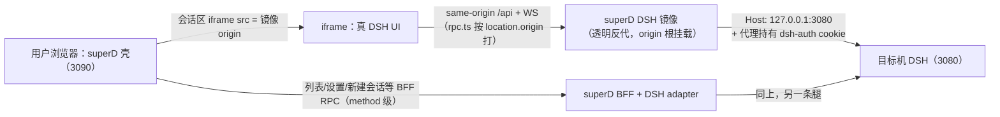

# DSH 运行时呈现层嵌入模式研究（iframe / 反代透传）

> 2026-09-08 · 起因：DSH runtime 的呈现层能否绕开"自有 composition"，直接复用上游 Web UI？
> 两个候选：①iframe 直嵌 3080 页面；②DSH adapter 假装 browser 向 3080 发请求、把 traffic
> 透传给 3090 前端。方法：上游源码一手核验（checkout `dsh-v0.1.2-alpha.5`，
> `~/workspaces/dashr/upstream/deepseek-harness`）。
> 结论先行：**两者都可行**；②其实就是蓝图 v0.2 已裁决的"DSH adapter wire 透传"形态的自然延伸，
> 真正的新选择是"前端也用上游的"——最干净的落法是 **iframe（或 iframe-over-反代）作为一个
> lite composition**，与终态集成 composition 并存，不冲突。

---

## 1. 四个变体速览

| 变体 | 前端是什么 | 代理代码 | 远程 machine | HTTPS 混合内容 | 集成度 | 定位 |
|---|---|---|---|---|---|---|
| **A 直连 iframe** | 上游真 UI（iframe src=3080） | 零 | ✗（浏览器须直达 3080） | 有风险 | 零 | 本地 DSH 的零代码捷径 |
| **B 反代 + iframe** | 上游真 UI（iframe src=镜像） | HTTP+WS 透明反代 | ✓（经 superD-to-superD） | ✓（镜像走 HTTPS） | 低（画布级） | **推荐的 M1 lite 形态** |
| **B′ 反代全页（无 iframe）** | 上游真 UI（整页） | 同 B | ✓ | ✓ | 零（无壳共存） | ✗ 主线；仅"远程访问网关"产品形态 |
| **C 集成 composition** | 自有 UI（agent-ui-dsh） | RPC 透传（蓝图既有） | ✓ | ✓ | 高（统一壳） | 蓝图 v0.2 终态 |

判定：B′ 把代理代码和零集成两头的成本都占了却无收益——**整页 app 无法与我们的壳共挂**
（同一页面装两套 client 模块表 = 同 id 硬错，上游设计即禁止；DSH UI 是整页 root 槽应用，
没有"挂在 div 里"的形态），且页面内没有我们的 selector。B′ 唯一合理用途是"superD 作为
DSH 远程访问网关"（独立产品卖点），不是统一入口的主线。

---

## 2. 上游事实核查（六条，均已一手核验）

1. **无 frame-busting 头**：`packages/host/`、`packages/boot/` 全量 grep 无
   `X-Frame-Options` / `Content-Security-Policy` / `frame-ancestors` → **DSH 页面可被 iframe**。
2. **token 只存在于 DSH 进程内存**：`client/connection/src/browser-auth.ts` —— launch token
   为进程内随机数（`PROCESS_LAUNCH_TOKENS` WeakMap，L52–60），**无 env 覆盖、不落盘**；启动时
   由 `authenticatedUrl()` 拼成 `/?token=…` 随 URL 打印（`bundle/web-app/src/index.ts:287` 调用）。
   → 获取路径只有一条：**读 DSH 进程的 stdout/journal/日志**。
3. **token → cookie 交换**：`GET /?token=…`（Host authority 必须在）→ `303` + 签名 cookie
   `dsh-auth-<authority>`，**24h 有效**（`authorizeIndex`，L236+）；token 本身**随 DSH 进程存活**，
   cookie 过期可用同一 token 重铸。401 响应体带指纹
   `dsh web authentication required; reopen the URL printed by dsh web.`（蓝图开放问题 #4 已记）。
4. **`/api` 信任栅栏按 Host 绑定，且"不是 auth 层"**（`api-request-trust.ts` 文件头注释）：
   loopback / 部署 LAN IP / 声明的 `trustedHosts` 过栅栏。→ 反代向上游发 `Host: 127.0.0.1:3080`
   即过；iframe 内页面对 3080 的调用是 same-origin（Host=loopback）也过。
5. **客户端 API base = `window.location.origin`**（`client/connection/src/client/rpc.ts:109–110`，
   缺省回退内部 base）→ **经反代时客户端自动打向代理 origin**，无需改上游客户端。
6. **资产/模块 URL 是 root-相对路径**（boot graph 里 `/plugins/??pkg/client.js&rev=…` 形态）→
   反代**必须挂在 origin 根**（独立端口或子域）；挂路径前缀（`3090/_dsh/`）会打断这些引用，
   除非连 boot graph JSON 一起做路径重写（可行但增加脆弱面）。

---

## 3. 变体 A：直连 iframe（本地零代码）

机制：superD 壳的会话区渲染 `<iframe src="http://127.0.0.1:3080/?token=…">`。iframe 文档的
origin 就是 3080，其自身的一切 `/api`+WS 调用都是 same-origin、Host=loopback → 栅栏直过；
token URL 首开后 303 换 cookie，此后 iframe 内自持会话。

- **前提 1（✓ 已核验）**：上游不设 frame 头。
- **前提 2（✓ 已核验）**：栅栏按 Host，iframe 内 same-origin 调用天然合法。
- **前提 3（工程项）**：token 注入——adapter 从 DSH stdout/journal 抓 URL（本地机器可做）。

局限：远程 machine 的 3080 浏览器不可达（superD-to-superD 才可达）；superD 壳若走 HTTPS
（Caddy），iframe 载入 plain HTTP 属混合内容，浏览器会拦；跨域 iframe 完全密封（壳不能
reach-in 折叠其自带 chrome）。

## 4. 变体 B：透明反代 + iframe（推荐 lite 形态）

"DSH adapter 假装成 browser"的准确工程含义：**adapter 以 browser 的口音说 HTTP/WS**（正确的
Host 头、持 cookie、做 WS upgrade），**不是**跑一个真的 headless browser（重且脆，不需要）。
实现就是标准反向代理：

实现要点：

- **origin 根挂载**（事实 6）：镜像监听独立端口/子域（本地如 3091+ 自动分配；远程经 Caddy
  路由到 remote superD 的镜像），纯透传、零重写。
- **认证归代理**：adapter 用抓到的 token 在镜像侧完成一次 `/?token=` 交换、持有并续期 cookie；
  **浏览器全程不见 DSH token**——对下游只有 superD 自己的认证面（authChain）。
- **WS 1:1 桥**：每个下游 WS upgrade 对应一条独立上游 WS（不做扇出 hub，M1 单用户足够）；
  streaming 响应禁缓冲。
- **401 自愈**：镜像收到指纹 401 → 重读目标机 DSH 日志取新 token → 重交换（DSH 重启 token
  轮换的自动恢复）。
- **可选 same-origin 增强**：若镜像与壳同 origin（路径前缀 + boot graph 路径重写），壳可
  reach-in 折叠 iframe 内 DSH 自带 sidebar（双 chrome 问题）；这是 nice-to-have，不作前提。

## 5. 与 v0.2 组合层架构的统一（关键：不二选一）

iframe **本身就是一种合法 composition**：`agent-ui-dsh-lite` 包往会话区槽 register 一个 iframe
组件（URL 由 adapter 供给：machine URL + token），selector 切换 = 换 composition——v0.2 的
机制原样适用，一行不用改。分工随之清晰：

- **会话画布**：lite 形态下 = 真 DSH UI（iframe）；终态 = agent-ui-dsh（copy 版）。
- **会话列表 / workspace / settings / TG consumer**：永远走 superD BFF 的 method 级 RPC
  （TG 本来就需要 method 级访问，adapter 的数据面两形态共用）——**统一入口不丢**：列表、
  选择器、机器管理都是我们的，iframe 只接管画布。
- **双 chrome**（iframe 内 DSH 自带 sidebar 叠在我们的壳里）：M1 接受；缓解路径 = 同源
  reach-in 或移动断点折叠。
- **红利**：镜像是 wire 层的"参考实现 + 永远新鲜的对照"——集成 composition 的字段映射
  可随时对着真实流量校准；上游 UI 更新零成本跟进（lite 形态下根本不维护 UI）。

## 6. token 获取与生命周期（两形态共用）

| 事实 | 值 | 出处 |
|---|---|---|
| token 存储 | 仅进程内存（WeakMap），无 env、无文件 | browser-auth.ts L52–60 |
| 发放面 | 启动时随 `authenticatedUrl` 打印到 stdout | web-app/src/index.ts:287 |
| token 寿命 | DSH 进程生命周期（重启即轮换） | WeakMap 语义 |
| cookie 寿命 | 24h，可用同一 token 无限重铸 | authorizeIndex + DAY_MILLISECONDS |
| 抓取实现 | 本地：journal/日志文件；远程：remote superD 读它本机的 | 蓝图本地发现三步可复用 |

长期项：向上游提 service-token / machine-token 配置需求（免除日志抓取）；M1 不依赖。

---

## 7. 验证清单（M1 裁决 lite 形态前）

1. [ ] 直连 iframe 本地 3080 实测：`?token=` 注入 → 303 → cookie 建立 → UI 全功能。
2. [ ] HTTPS 壳（Caddy）iframe plain-HTTP 127.0.0.1 的混合内容行为（桌面 + 移动 Chrome）。
3. [ ] 镜像反代全通：静态资产 + boot graph + `/api` unary + WS upgrade + streaming。
4. [ ] WS 经代理的 connection generations 行为（断线重连、代理重启）。
5. [ ] DSH 重启 token 轮换 → 401 自愈链路。
6. [ ] 双 chrome 观感裁决（接受 / reach-in 折叠 / 移动断点）。
7. [ ] 同源变体的 boot graph 路径重写成本评估（仅当需要 reach-in 时）。

## 8. 建议

- **M1**：本地 DSH 用变体 A（零代码）；远程 DSH 用变体 B（镜像反代）。`agent-ui-dsh-lite`
  （iframe composition）先落地，`agent-ui-dsh`（集成 copy）延到 M2+。
- **终态**：蓝图 v0.2 的集成 composition 不变；lite 作为长尾保留（"用最新原版 DSH UI"本身
  可以是一个用户选项）。
- **不做**：B′ 全页镜像作主线；headless browser 方案。

---

## 来源

- 上游 checkout（`~/workspaces/dashr/upstream/deepseek-harness`，tag `dsh-v0.1.2-alpha.5`）：
  `packages/client/connection/src/{browser-auth,api-request-trust,rpc-host}.ts`、
  `packages/client/connection/src/client/rpc.ts`、`packages/bundle/web-app/src/index.ts`；
  `packages/host/`+`packages/boot/` frame 头 grep（空）。
- `00-blueprint.md` v0.2（§3 adapter 体系、§3.5 composition、开放问题 #4/#7）；
  `01-component-boundaries.md`（呈现层替换带）。
- 运维证据：`docs/60_exploration-and-research/`（boot graph 模块 URL 形态、token 轮换实践）。
