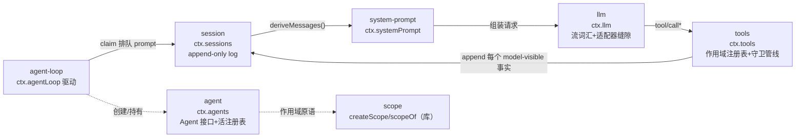
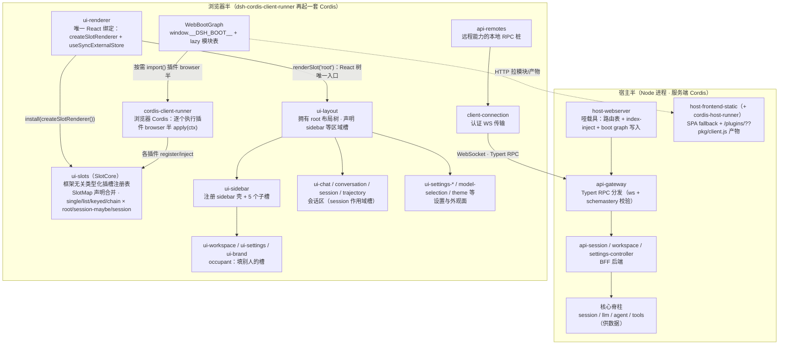
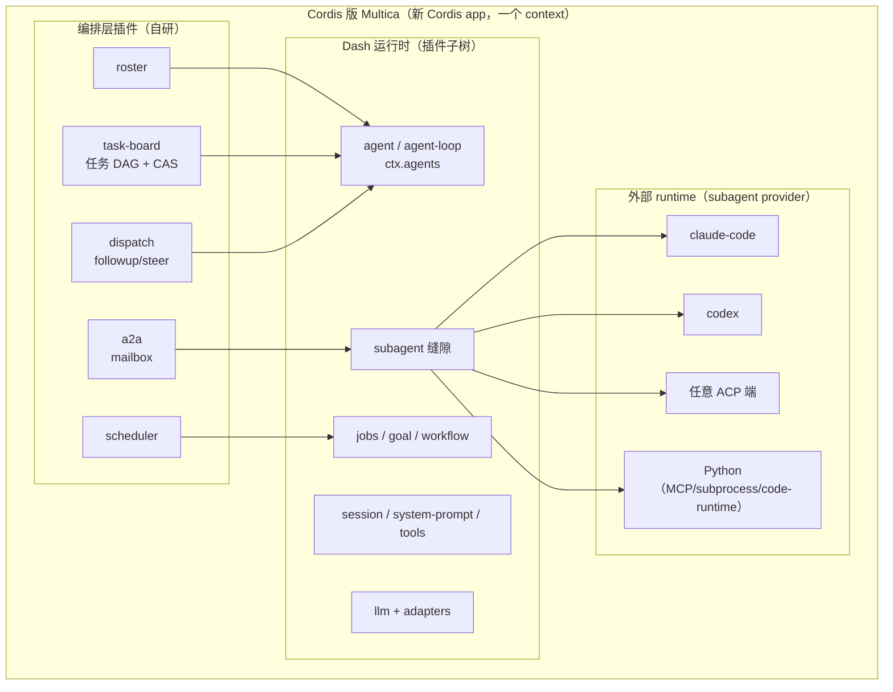

# DeepSeek Harness（Dash）研究

> 记录：2026-08-21 · 一手核验：`github.com/deepseek-ai/deepseek-harness`（176,180★，master @
> 2026-08-19）官方 docs + `vendor/README.md` + `docs/module-graph.md`（脚本生成的 peerDeps
> 依赖图）+ 本地 `~/.dsh/profiles/node_modules/@deepseek-ai/`（195+ 插件）。
> 本文是 Dash 单侧研究（与 Cordis 解耦后的文档；Cordis 侧见 `cordis-research.md`；
> 部署/patch/安全/Corti 集成见 `deepseek-dsh.md`）。
> 2026-09-07 修订：§1 增补两节——「Web UI 面细化图」（模块图谱中浏览器半的展开）与
> 「"Everything is plug-in" 的语言层实现」（时空可组合性的 TS/JS 机制深潜）；依据见文末来源增补行。

---

## 1. 架构与框架测绘

### 总览

Dash（`dsh`）是 DeepSeek 官方开源 Agent 运行时，**"everything is a plugin"**，内核即 Cordis。
**没有特权核心可 patch**——你通过"挂一个插件到其它插件旁边"来扩展它；注册即效应，卸载时
逆序撤销。四模式（Standard/Minimal/PTC/Creator）= 同一宿主装配不同工具/提示词/运行时。

### 组装模型：Profile → Bundle → Patch

一个运行中的 `dsh` = 启动时从**有序层**合成的插件树：

```
bundle 层（package.json `dsh.profile.bundles` 列出）
  └─ dsh-base        # 第一层：模型适配器/工具/持久化/沙箱/审批/设置/凭据/遥测
  └─ dsh-web-app     # 浏览器应用面（或 dsh-headless：one-shot runner）
→ cordis.patch.yml（profile 级）→ cordis.patch.yml（home 级）→ --patch 覆盖层
```

`dsh-base` **没有 runtime API**——它只是一个 `cordis.patch.yml`，把每个基础插件行（模型适配器、
agent-default-model、工具、持久化、策略、设置/凭据、遥测、subagent provider）insert 到空
profile 根上。**换任何"核心"能力 = patch 该行。**

### 核心脊柱：六包一条循环



| 包 | 拥有 | ctx key |
|---|---|---|
| `session` | append-only `SessionEvent` log + 内存 store（唯一真相源） | `ctx.sessions` |
| `system-prompt` | prompt-section + tool-schema 装配 | `ctx.systemPrompt` |
| `tools` | 作用域工具注册表 + 守卫执行管线 | `ctx.tools` |
| `agent` | `Agent` 接口、活注册表、`agent/*` 事件词汇 | `ctx.agents` |
| `agent-loop` | 实现 `Agent` 契约的默认驱动 | `ctx.agentLoop` |
| `scope` | per-agent 作用域注册原语（依赖零的库） | — |

### 能力缝隙（Seam）：三角色

一个 **seam** = **Service Definition**（声明接口的 Cordis `Service`，抽象类或具体注册表，
绝不用 TS `interface`）+ **Service Provider**（实现）+ **Consumer**（inject 该服务）。
典型：`dsh-shell`（定义）+ `dsh-bash-local`/`dsh-bash-sandbox`（提供者）+ `dsh-tool-bash`
（消费者）。**换一个 provider 就换整个产品**：filesystem 与 subprocess 共享一个执行世界，
指向远程沙箱即同时移动 Bash/PTY/LSP，无 provider fork。

### Agent 的精确命名

框架规范名（**无 "Agent Body" 一词**，最接近的是 `Agent` 接口 + `agent-loop` 实现）：

- **`Agent`** —— 公共活 agent 句柄（接口）：`id/options/session/inbox/status/ctx` +
  `cancel/whenIdle/runMaintenance/send/followup/steer/inject`。
- **`AgentFactory`** —— 注册表背后的创建接口：loop 经 `ctx.agents.setFactory()` 注册，
  消费者用 `ctx.agents` **不依赖具体 loop 包**（loop 保持可换）。
- **`agent-loop`** —— 实现公共 `Agent` 契约的**具体驱动**（"身体"的默认实现）。
- **`AgentHandle`** —— `create()/resume()` 返回的 `{ agent, dispose() }`，`dispose()` 是
  CAPABILITY。
- **`AgentRegistry`** —— `ctx.agents`，活注册表。

### Session log：唯一真相源

`Session` 是 typed `SessionEvent` 的 append-only 日志；LLM 消息历史由 `deriveMessages()`
**从日志推导**。**"model-visible means logged"**——凡到达模型请求的内容必须可从日志重建，
有运行时不变量断言。fork/resume/transcript/telemetry/persistence 全从这条流推导。

### 模块图谱（~195 包，40+ 分组，peerDeps 为边）

```mermaid
flowchart TD
    subgraph SPINE["core 脊柱"]
        SESSION["session"] --> LLM["llm"]
        SYS["system-prompt"] --> LLM
        AGENT["agent"] --> SESSION
        AGENT --> SYS
        LOOP["agent-loop"] --> AGENT
        TOOLS["tools"] --> SESSION
    end
    subgraph CAP["能力缝隙（定义+提供者+消费者）"]
        LLM --> LLD["llm-deepseek / llm-pi-ai"]
        FS["fs"] --> FSL["fs-local / fs-e2b"]
        SHELL["shell"] --> SHB["bash-local / bash-sandbox / pwsh-*"]
        SUBPROC["subprocess"] --> SUBL["subprocess-local / subprocess-e2b"]
        CODE["code-runtime"] --> CRW["worker-thread / python"]
        MCPC["mcp-client"] --> LLM
        LSP["lsp"] --> LSPI["lsp-stdio"]
    end
    subgraph ORCH["编排原语"]
        SUBAGENT["subagent"] --> SUBP["spawn/fork/acp/codex/claude-code/dsh-sdk"]
        GOAL["goal"] --> GOALR["goal-round-driver"]
        RALPH["tool-ralph / workflow"]
        TEAM["experimental-agent-team"] --> SUBAGENT
        SCHED["schedule"]
    end
    subgraph HOST["宿主/客户端"]
        API["api-gateway"] --> APIREM["api-remotes"]
        HOSTW["host-webserver"] --> FRONT["host-frontend-static"]
        CLIENT["client-runtime / client-connection"]
        UI["client-ui-*（~40 包）"]
    end
    subgraph PERSIST["持久化/查询"]
        SPERS["session-persistence(jsonl/sqlite)"]
        SQRY["session-query-sqlite"]
        STORAGE["storage(json/sqlite/domain)"]
    end
    subgraph SDK["程序化面"]
        SDK["sdk-jsonrpc-server / sdk-client / sdk-protocol"]
        ACP["acp"]
    end
    LOOP --> AGENT
    SUBAGENT --> AGENT
    GOAL --> AGENT
    TEAM --> AGENT
    API --> AGENT
    CLIENT --> AGENT
```

> 完整边表见 `docs/module-graph.md`（1688 行，脚本生成）；HOST 组中被压成单个 `UI` 节点的
> Web UI 面展开见下节。

### Web UI 面细化图：浏览器里的第二个 Cordis

模块图谱 HOST 组把 ~40 个 `dsh-client-ui-*` 包压成了一个 `UI` 节点——本节单独展开（机制一手核验见
`dsh-web-ui-slot-system-research.md`；220 包四层分类见 `dsh-web-profile-package-map.md`；官方文档蒸馏
dsh-dev-skill ch18）。先立要点：

- **双半插件（dual-half）**：每个 `dsh-client-ui-*` 包有两个入口、编译成两个目标。host 半是空
  `apply()`——只为让服务端 Loader 有东西可挂、把包纳入 boot graph；browser 半是真
  `apply(ctx: ClientContext)`，写法与服务端 Cordis 插件**完全一致**：`export const inject =
  ['slots', 'layout', ...]` 声明依赖，`ctx.effect(() => ctx.slots.register(...), 'label')` 登记
  可撤销副作用。
- **浏览器里再起一套 Cordis**：`dsh-cordis-client-runner` 在页面里运行完整 Cordis 运行时
  （fiber/registry/reflect/events 齐备），逐个执行各插件的 browser 半（host 侧对应
  `dsh-cordis-host-runner`）。宿主把组合结果写成 **WebBootGraph**（`window.__DSH_BOOT__`，经
  index-inject 随 index.html 注入）：一张 lazy CommonJS 模块表 + 预取清单；浏览器按需 `import()`
  插件 client 半（HTTP 经 `/plugins/??pkg/client.js` 路由拉取），**激活顺序由 inject 依赖决定，
  不是模块表顺序**——两端各自跑同一套时空机制。
- **UI 组合 = 类型化插槽注册表**：`dsh-client-ui-slots`（SlotCore 内核，零 React、零 cordis
  依赖）持有 `SlotMap`——一个空接口，各插件用 `declare module` 声明合并写入自己的插槽契约
  （与服务端 `declare module './context.ts'` 合并 `Context` 是**同一机制**：组合契约靠编译期检查，
  不靠字符串口头约定）。两轴定形：基数 `single / list / keyed / chain` × 作用域
  `root / session-maybe / session`（session 槽自动注入 `sessionId` 座）。
- **React 只是可替换的渲染后端**：`ui-renderer` 是唯一 React 绑定（`createSlotRenderer` +
  `useSyncExternalStore`，全 UI 层只有它用 React context）；整个 App 的 React 树只有一个入口——
  `ctx.slots.renderSlot('root')`，渲染器递归展开插槽树。业务状态是框架无关的 `HostObservable`
  （`getSnapshot` + `subscribe`），经 `useSyncExternalStore` 转成 `use<Name>(selector)` hook——
  换渲染器只换 `createSlotRenderer()`，插槽树与业务插件一行不改。
- **RPC 边界即前后端分界**：浏览器 Cordis 里插件 inject 到的 session/workspace/settings 服务，
  是 `dsh-api-remotes` 提供的**远程能力本地代理**——经 `client-connection`（认证 WS 传输）打到
  宿主 `dsh-api-gateway`（Typert RPC 分发 + schemastery 校验）→ `api-*-controller`（BFF）→
  核心服务。前端组件与后端服务之间不是 REST 边界，是 Typert RPC 边界。
- **哑载具原则**：`host-webserver` 不懂任何 harness 概念——只有路由表（exact/prefix + 单座
  fallback）、`webserver/index-inject` 结构化注入行、boot graph 写入；`/api` 的信任栅栏
  （Host/Origin 校验、会话认证）全部由组合层的 Connection 插件供给。安全是**组合性质**，
  不是服务器性质。
- **类型双轨**：运行时数据走上文的 RPC 管道，但**类型走旁路**——40 个 UI 包里 17 个直接
  `import type` 底层核心（`dsh-session/types`、`dsh-llm`、`dsh-agent`/`dsh-scope`，约 70 个
  文件）。`import type` 擦除后零运行时耦合，是"禁止运行时 import 其他 feature 插件"这条硬
  边界（跨包 UI 只走 slots）下唯一合法的跨层引用。



> 活树查询：`cordis_inspect what:"client"`；slot 键/基数/作用域目录由上游
> `pnpm run gen-client-catalog` 生成（ch18）。

### "Everything is plug-in" 的语言层实现：哲学主张 → TS/JS 机制

> 2026-09-07 增补。哲学口号只有落成语言机制才是工程事实；本节把 dsh 的几句口号逐一钉到
> TS/JS 的承载机制上。Cordis 侧完整考证见 `../01-cordis-runtime/cordis-research.md` §3/§4，
> 语言层逐点还原见 `../01-cordis-runtime/js-ts-language-fundamentals.md`（分层纪律：L2 = JS/TS
> 语言本身，L3 = 框架/dsh 业务代码；讲机制只允许 L2 词汇，L3 名词当场还原成 L2 清单）。

| 哲学主张 | JS 语言机制（L2） | Cordis 构件（L3） | dsh 中的落点 |
|---|---|---|---|
| 一切皆插件（无特权核心） | 函数/类是一等**值**；`Map` 拿任何值当键；动态 `import()`（运行期按 specifier 引入代码） | Registry 的 `Map<callback, Runtime>`；Loader 配置树 | 195+ 包全是配置树上的行；六脊柱不是特权位 |
| 插得上（注册即生效） | Proxy get 陷阱**现算**属性——每次读取都是一次字典查询 | `ReflectService.store` + `notify` | `ctx.llm`/`ctx.tools` 读到的是当前活跃实现 |
| 拔得下（副作用可逆） | 闭包捕获清理逻辑；数组 `reverse()` 定撤销序 | `Fiber.effect()` + DisposableList（LIFO） | 一切 `ctx.*` 登记调用都交出 disposer |
| 依赖自愈（免重启） | 名字（字符串/symbol）做耦合键 + 运行时 late binding | `inject` 声明 + `epoch` 签名 + unload/reload | seam 换 provider、HMR、`!!js` patch |
| 类型不挡路（开放命名空间） | 声明合并/模块增强——纯编译期、擦除后零运行时成本 | `declare module './context.ts'` | Service Definition 用 abstract class 而非 interface |

#### (1) 挂载的语言真相：插件是值，"核心"是字典里的普通条目

插件入口只有三种形状，全是**值**——直接可调用的函数、构造器（类也是对象，`typeof ===
'function'`）、带 `apply` 的普通对象；`RegistryService.resolve()` 只认这三类：

```ts
export default function myPlugin(ctx: Context, config: Config) { /* ... */ }  // 函数形状
export default class MyService extends Service { /* ... */ }                  // 构造器形状
export default { apply(ctx, config) { /* ... */ } }                           // 对象形状
```

挂载动作 `ctx.plugin(entry, config)` 是一次普通函数调用：Registry 以**插件回调本身**为键查
`Map<callback, Runtime>`（同一插件多次挂载共享一条 Runtime 记录、各得一个 Fiber）→
`new Fiber(...)` → 该插件专属子 context = `parent.extend({ fiber })`。`extend()` 的语言本质是
**手搓原型链**（教学骨架；真实源码另加 traceable 包装与 meta 的 own-key 拷贝循环）：

```ts
extend(meta = {}) {
  const child = Object.create(this)        // 子 ctx 的 [[Prototype]] 指向父 ctx——实例对实例
  for (const key of Object.keys(meta)) child[key] = meta[key]  // {fiber} 等落为子层自有属性
  return child                             // child 未命中的属性读取沿链回落到父 ctx
}
```

于是"核心"在语言层被祛魅：进程里唯一的特权物是 `new Context()` 构造函数**同步**造出的四服务
（reflect/registry/events/logger）+ 根 fiber——类定义在模块加载（t0）就位、实例在 `new Context()`
（t1）一次造齐，此后只有"往实例里填条目"，再无"造新实例"。dsh 的一切——包括
`session`/`system-prompt`/`tools`/`agent`/`agent-loop` 六件脊柱——都是 Loader 从配置树逐行
`ctx.plugin()` 上来的普通条目；**"核心" = 恰好被最多插件 inject 的那一行**，patch 按 id 整行
重述即可换掉（`name` 重指即整插件替换）。配置树本身只是数据：YAML/JSON 字面量 → Loader
Entry → `tree.import(specifier)` 动态 `import()` → `unwrapExports()` 归一 →
`ctx.registry.plugin(...)`——**"组装"在语言层就是"解析一段数据 + 按行调一个函数"**。

#### (2) 时间维：注册即效应——每个登记 API 都交得出"怎么拆"

`Fiber.effect(execute, label)`：`execute` **立即执行**，返回值被收集为 disposer；接受四种
形状——单个函数 / `Promise<函数>` / 迭代器 / 异步迭代器（生成器形状支持**流式登记**：长任务
边跑边 yield disposer，每笔立即入账）：

```ts
ctx.effect(() => {
  const stop = startSomething()   // 立即生效
  return () => stop()             // 返回"怎么拆"
})
```

dsh 插件代码里的每一笔登记——`ctx.on(...)`（返回注销函数）、`ctx.tools.register(...)`、
`ctx.provide(...)`、浏览器半的 `ctx.slots.register(...)`——全部走这条路。撤销序 LIFO 有两处
源码实证：单笔 `disposables.splice(0).reverse()`；fiber 整体卸载 `DisposableList.clear()` 同样
逆序。语义是**后建立的先拆**——先拆"用连接的回调"、再拆"连接本身"，保证不会拆到还在被使用
的东西；disposer 单次性（第二次调用 no-op），async disposer 会被 await。

关键认识：**框架不替你回滚状态，它只认 disposer**。"拔得下"是 dsh 一条 API 设计纪律——把
一切注册 API 都设计成交得出 disposer——的自然推论：卸一个插件 = 逆序跑光它 fiber 的清单，
进程里没有"残留扫描"这个环节。边界同样明确：session log 的 append **不是** effect——
append-only 日志是持久事实（"model-visible means logged"），不随插件卸载消失。时间维撤销的是
**进程内副作用**，不是**已记录的历史**；两层在 dsh 被显式分开（内存 store 可从日志重建，
日志本身不可篡改）。

#### (3) 空间维：耦合点是名字，不是引用——`ctx.llm` 的一次读取

```
表达式 ctx.llm                    ← 一条属性读取，编译期不知道会得到什么
1. 引擎发现 ctx 是 Proxy——new Context() 构造函数 return 了包装对象（new 的"返回对象"后门）
2. 引擎调用 handler.get：一段普通 JS 函数（ReflectService 类的 static 属性）
3. 依次分流：
   a. 'llm' 是特殊属性？否
   b. raw context 自身有 'llm' 这个自有属性？否（自有属性就那几个）
   c. props 表里有 accessor 定义（mixin 投影，如 ctx.on）？否
   d. 当作服务名：算作用域键（isolate 符号）→ 在 store 字典（Object.create(null) 的
      null-prototype 对象）里查记录 { name, fiber, value, check } → 返回 value
4. 引擎把返回值当作整个表达式的值
```

这就是"免重启换实现"的语言层本质：**`import` 绑定在模块加载时一次定死；`ctx.llm` 属性读取
每次现算**——同一个表达式在不同时刻可以解析到不同对象（提供者换人、服务热替换），读取方
代码一个字符不改。dsh 的消费者包 import 的只是 `dsh-llm`/`dsh-agent` 的**类型**（`import type`，
擦除后零运行时耦合），运行时耦合的是字符串服务名——依赖 `agent` 接口的 ~70 个包全在此列、
无一依赖 `agent-loop` 具体实现（§3 取证）。§1 的 seam 三角色在语言层的投影于是可以说清：
**abstract class 定义（运行时真实存在的合同）+ store 字典槽（这一格现在装着谁）+ Proxy 名字
解析（读取那一刻查）**。

依赖自愈的闭环全在数据结构里：provider 注销/换值 = `provide('llm', x)` 写字典 +
`notify(['llm'])` → 遍历 registry 中所有 inject 了 `'llm'` 的 fiber → `_checkImpl()`（重解析实现
进 `_store`，含 `check()` 可用性谓词）→ `_refresh()` 重算 **epoch 签名**——任一依赖缺失 →
`INACTIVE` 哨兵；全齐 → `':' + 提供者1.fiber.uid + ':' + 提供者2.fiber.uid + …`，把"我依赖谁的
哪一代"压成一个字符串指纹。epoch 变化驱动状态机：`有效 → INACTIVE` 或**提供者 uid 变了**
（`':3'` → `':7'`，换人了）→ `_unload()`（LIFO 跑光该 fiber 全部 disposer，回 PENDING）→
签名又有效则 `_reload()` 重放 apply——插件代码**从头重跑一遍**，拿到新提供者的引用。所谓
"迁移" = 卸载-重放循环，不是把对象搬家；Cordis 刻意不做增量更新（哪怕新旧实现 API 兼容也
整 fiber 重放），用重放成本换掉全部手写迁移代码。附：`ctx.get(name, strict=false)` 可不声明
inject 偷看服务（拿不到得 undefined、不抛错）——但偷看不建立响应关系，服务来了不会唤醒你。

#### (4) 类型层的对称投影：`declare module` 合并出"开放命名空间"

```ts
// 每个服务模块把"我投影到 ctx 上的方法"同时写进 Context 类型——模块增强，纯编译期：
declare module './context.ts' {
  export interface Context {
    plugin<T>(plugin: Plugin<T>, config?): Fiber<T>      // registry.ts 追加
    on(event: string, listener: () => void): () => void  // events.ts 追加
    // reflect.ts / fiber.ts / logger.ts 各追加各自的投影
  }
}
```

**运行时与编译期严格对称**：运行时 Proxy + mixin 把五个服务的表面压平成一个 ctx 对象；编译期
五个模块的 `declare module` 把类型表面合并进一个 `Context` 接口。ctx 因而是"开放命名空间"——
任何插件都能往里加成员（运行时 provide、类型层增强），与 "everything is plug-in" 是同一句话
的两面。三个直接的工程后果：

- **Service Definition 必须是 abstract class（或具体注册表），绝不能是 TS `interface`**（§1
  缝隙一节那条规则的语言层理由）：interface 擦除后运行时无物，而 definition 要在运行时被
  `provide`/`inject` 对照、要能被 provider `extends` 出具体实现——abstract class 同时是**值**
  （可 extends、子类可 new）和**类型**（合同）。类型擦除在这里不是缺陷，而是把合同钉进运行时
  的手段。
- **跨副本互操作靠全局注册表符号**：Cordis 内部符号（isolate/effect/invoke/check/…）全部用
  `Symbol.for('cordis.*')` 定义——同进程装入两份 cordis 副本（vendored `@deepseek-ai/cordis` +
  npm `cordis`）时符号仍相等，互操作不碎；类型侧用 `unique symbol`（symbol 能做 interface
  计算键的唯一途径）把运行时值拴到类静态声明上。§2 的 vendoring 策略直接站在这个根基上。
- **"开放"不等于"随便"**，硬边界两层同时成立：同 scope 同名 `provide` 抛错（无 last-wins、
  兄弟遮蔽不存在，仅祖先/isolate 遮蔽合法）；浏览器模块表同 id 双侧硬错；官方 UI 组件遮蔽走
  slot 同 cell 更低 priority 注册（lowest renders），而非 import shadowing。

#### (5) 时空合流：一次 provider 切换的完整生命周期

以 patch 把 shell 执行世界从 `bash-local` 切到 `bash-sandbox` 为例，把 (1)–(4) 串成一条因果链
（`dsh-shell` 定义 + 两个 provider + `dsh-tool-bash` 消费，见 §1 缝隙）：

```
patch 行按 id 整行重述（name 重指 bash-sandbox；或 disable 旧行 + add 新行）
→ 旧 provider fiber 卸载：'shell' 服务注销——provide 的 disposer 里删 store 条目 + notify
→ 消费者 fiber（inject 'shell' 的 dsh-tool-bash 等）epoch → INACTIVE
   → 各自 _unload()：LIFO 拆光自己登记过的全部副作用（工具定义、监听器…）
→ 新 provider 挂载：'shell' 重新 provide → notify → 消费者 epoch 恢复有效
   → _reload() 重放 apply → ctx.tools 里 bash 工具解析到新执行世界
   （fs/subprocess/sandbox 同界连动——"换一个 provider 就换整个产品"）
→ agent-loop 无感：它 inject 的 'tools'/'agent' 服务没换代，fiber 不动
```

这正是 Cordis 研究 §5 结论在 dsh 的实例化：**空间维被数据化**（store 字典 + epoch 签名是运行时
可增量重算的数据），**时间维被机制化**（effect 收集 + notify 重算是机制），两者在单线程事件
循环上合流——自愈 = 空间数据的一次变更事件，驱动时间维机制重放受影响子图。这也是 §4"编排层
也是插件"成立的语言层根据：编排插件与 dsh 插件挂同一个根 context，靠同一套字典/效应/签名
机制参与时空可组合性，无一需要特权。全部机制用 L2 普通设施（对象、字典、闭包、Proxy、原型
链、动态 import）写成——**Cordis 没有语言特权，"框架机制"只是普通代码的组合**。

---

## 2. 上游 Cordis 解耦与分支

### 结论：已经解耦、已经长出分支

你的判断（"入口永远是 DeepSeek 官方名下的 Cordis package"）**不仅成立，而且已经发生**。

### Vendoring 机制（`vendor/README.md` 取证）

dsh **source-vendor** Cordis 进 `vendor/`，并把所有包**重命名进 `@deepseek-ai` scope**：
`cordis` → `@deepseek-ai/cordis`，`@cordisjs/plugin-<x>` → `@deepseek-ai/cordis-plugin-<x>`。
官方理由：① **完全拥有框架层**（auditable/patchable/pinned）；② 若用上游名发布会
squat 上游 npm 名。目录名与上游版本号**刻意保留**，使 manifest 仍读作"上游快照"。

### 关键：DeepSeek **已经 fork** 了 Cordis

vendored manifest 的 "Upstream repo" 列暴露出分裂已经发生：

| 包 | 上游来源 | 说明 |
|---|---|---|
| `cordis`（核心） | `github.com/cordiverse/cordis`（packages/core）@ 4.0.0-rc.7 | **仍跟上游 Shigma** |
| `loader` | `github.com/cordiverse/cordis`（packages/loader） | **仍跟上游** |
| `include`/`group`/`timer`/`hmr`/`logger-console` | **`github.com/deepseek-harness/cordis`** | **DeepSeek 自有 fork** |
| `cosmokit` | **`github.com/deepseek-harness/cosmokit`** | **DeepSeek 自有 fork** |
| `schemastery` | **`github.com/deepseek-harness/schemastery`** | **DeepSeek 自有 fork** |

即：**核心 `cordis` + `loader` 仍锚定 `cordiverse/cordis`，但外围包（include/group/timer/hmr/
logger-console/cosmokit/schemastery）已锚定 `deepseek-harness/*` 的 fork**。分裂已在发生。

### 18 项本地修改（实质分歧，非改名）

`vendor/README.md` 的 "Local modifications" 日志列了 18 项，含实质性改动：fiber 生命周期
加固（重入 disposal 三处缺口）、transactional Loader/Include 配置对账、patch 语义（insert 行
可被后续 patch 命中）、Windows 修复、lazy config resolution（port 上游 PR #41）等。这些是
**上游 `cordiverse/cordis` 没有的**——即 `@deepseek-ai/cordis` 与上游已是不同代码。

### 对锚定生态的含义

- **锚定 Dash 生态 = 锚定 `@deepseek-ai/cordis`**（DeepSeek vendored + 本地修改的副本），
  **不是**上游 `cordiverse/cordis`。任何"基于 Dash 的编排框架"都应以 `@deepseek-ai/cordis`
  为内核，而非 npm 上的 `cordis`。
- 你的"DeepSeek 资源更充足、与原作者合著论文、后续维护由 DeepSeek 主导"的推断有据：核心
  包仍跟上游，但外围已 fork，且本地修改已实质化。**"长出各自分支"不是未来时，是现在进行时。**

---

## 3. Alien Agent Provider（挂一个异质 agent loop）

### 结论：可行，且这是 dsh 的显式设计；但成本在于"符合两个契约"，不是"加个插件就完事"

### 决定性证据：`agent-loop` 只有一个依赖者

从 `docs/module-graph.md`（peerDeps 依赖图）直接取证：

- **依赖 `agent-loop` 的包 = 仅 `agent-spine-demo`**（示例装配）。唯一依赖者。
- **依赖 `agent`（接口）的包 = ~70 个**，包括：`client_runtime`、`client_ui_conversation`、
  `client_ui_trajectory`、`headless`、`api_remotes`、`sdk_jsonrpc_server`、`subagent`、
  `tools`、`goal`、`jobs`、`schedule`、`workflow`、`experimental_agent_team`……

**含义**：Web UI（`client_ui_*`）、headless、API、编排原语——全部消费 `agent`（接口），
**没有**消费 `agent-loop`（具体驱动）。文档原话："Extension plugins depend on `agent` …
and never on `agent-loop` directly, so **the loop stays swappable**"。`agent-loop` 只是
`dsh-base` 的 `cordis.patch.yml` 里一个可被 patch 替换的普通插件行。

### 挂入一个异质 agent provider（Pi / OMP / Hermes）的契约

要复用官方 Web UI，异质运行时必须满足**两个契约**：

1. **`Agent` 接口 + `AgentFactory`**：经 `ctx.agents.setFactory()` 注册一个 factory，其
   `create()/resume()` 返回实现 `Agent` 接口的句柄（`id/options/session/inbox/status/ctx` +
   `cancel/whenIdle/send/followup/steer/inject`）。Web UI 只认这个接口。
2. **`SessionEvent` append-only 日志**：异质 loop 必须**写入 `ctx.sessions`**（`turn/start`、
   `user/message`、`assistant/chunk`、`tool/call`、`tool/result`、`step/end`…），因为 UI/
   telemetry/replay/fork 全从这条流渲染与重建。**"model-visible means logged"** 是硬不变量。

**这就是真正的成本**：Pi/OMP/Hermes 各有自己的内部 loop 与消息/日志表示，把它们适配到
dsh 的 `Agent` 句柄 + `SessionEvent` 词汇，是**实质改造**，不是"把 Pi 的 Cordis plugin 加进去
就符合下游 consumer 接口"那么轻——接口符合 ≠ 日志语义符合。

### 两种挂载策略

**(a) 替换 factory**：Pi 的 loop 注册为**唯一** `AgentFactory`，Pi 成为 THE loop。Web UI 无感
复用。适合"只想换一个 loop"的极简场景。

**(b) 多 provider loop 注册表（更贴合 dsh 哲学）**：像 LLM adapter（`llm-deepseek`/
`llm-pi-ai` 多 provider）与 subagent（多 provider 命名注册）那样，把 `agent-loop` 从
"单一具体实现"升级为**一个 seam**——Definition = `Agent`/`AgentFactory` 契约，Providers =
`dsh-loop`/`pi-loop`/`omp-loop`/`hermes-loop`，Consumers = `ctx.agents` + Web UI。这样一个
profile 可按 provider route 给不同 agent 选不同 loop（如"reviewer 用 Hermes loop，executor
用 Pi loop"）。

### 理论可行性判定

**可行**。前提是异质运行时被适配到 dsh 的 `Agent` + `SessionEvent` 契约；适配完成后，官方
Web UI 与所有编排原语（subagent/goal/jobs/schedule/agent-team）**无需改动**即可驱动它——因为
它们本就只依赖 `agent` 接口。这正是 dsh 把"loop 可换"写成设计原则的原因。

> **落地实例**：本文 §3 的"异质 agent provider"已有一份具体设计——把本机 OMP 桥接为
> Dash 的 `AgentFactory` 插件，见 [`dsh-omp-provider.md`](dsh-omp-provider.md)。

---

## 4. 基于 Cordis 构建编排框架（包含 Dash）

### 结论：能。Dash 本身就是一个 Cordis app；编排框架 = 新 Cordis app 把 Dash 运行时当插件
子树挂入 + 叠加编排插件。

### 关键论据

1. **Dash = Cordis app，无特权核心**：编排层与 Dash 插件在同一 context 平等共存——**编排层
   也是一堆插件，不是特权核心**。
2. **时间维 = 编排的动态性**：多 agent 编排要"运行时加减 agent、换工具、撤掉挂掉的后端不伤
   运行中任务"——正是可逆效应。一个 teammate 下线 = 卸它的插件树，副作用精确撤销。
3. **空间维 = 编排的依赖编排**：编排插件 `inject ctx.agents` 等；依赖缺失自动 INACTIVE。
4. **仓库内已有雏形**：`experimental-agent-team`（`ctx.agentTeams`）已在 `ctx.agents` 上实现
   **roster + 任务 DAG（`blockedBy` 无环 + CAS revision）+ mailbox + spawn/send/wait**——就是
   一个 mini Multica。

### Multica → Cordis 映射

| Multica 概念 | Cordis-native 等价 | 备注 |
|---|---|---|
| Agent runtime | `ctx.agents` 里的活 `Agent`（Dash 进程内一级公民） | 非原生走 `ctx.subagents` provider |
| Kanban / issue | 编排插件拥有的 task DAG（参考 agent-team `TeamTask`） | 状态+`ownerId`+`blockedBy`+`writeScopes` |
| 指派 agent 跑 issue | `agent.followup()/steer()/send()` | 或 `spawnTeammate` 派生 continuable 子 agent |
| 状态变更 | `agent/status` 事件 + 任务 CAS revision | `agent/*` 是公开扩展点 |
| A2A | `ctx.subagents` continuable 子 agent + `report`/`sendMessage` | 或 agent-team mailbox |
| 调度 | `ctx.schedule` + `ctx.jobs` | Cordis `timer` 提供原语 |
| 持久化 | `ctx.sessions` log + `storage` + `session-persistence` | 事件溯源 |
| REST API / daemon | `dsh-api-gateway` + `sdk-jsonrpc-server` + `acp` | 已有程序化面 |
| 跨机器 | `host-webserver` + `api-remotes` / SDK / ACP | 需自建多机协议 |

### 与 Multica 的关键差异

- **Multica 靠 ACP/JSONL stdio 桥接非原生 runtime**（DSH 走私有 `@multica-ai/dsh-runtime`
  bridge + 硬编码 `--profile multica`；prime-agent 走 `hermes` ACP family wrapper）。**Cordis
  native 方案里 Dash 是进程内一级插件，零桥接、零协议翻译、零硬编码 profile 名。**
- 非 Cordis runtime（Claude Code/Codex/任意 ACP）作为 `ctx.subagents` provider 接入（dsh 已
  ship `subagent-claude-code`/`-codex`/`-acp`/`-dsh-sdk`），仍是"编排层 = 插件"统一模型。

### 提议架构



### 两种落地形态

1. **子树挂载（include）**：用 `cordis-plugin-include` 把 dsh 的 agent 运行时插件树作为子树
   挂到编排 app 的 scope——dsh 自己 per-session preset 的同一机制。
2. **同 context 并列组装**：编排插件与 dsh 插件同 context，编排插件 `inject ctx.agents` 等。
   agent-team 的做法，最直接。

**推荐先走形态 2**（复用 dsh 现成的 agent/subagent/schedule 缝隙，零新协议）；形态 1 作为
"把一整个 Dash 当可插拔单元"的高级形态。

### 风险与权衡

- **API 不稳定**：developer preview，core plugins/APIs 会变；编排层须锁 rc 版本、把依赖 dsh
  缝隙的部分做成薄适配。
- **单进程扩展性**：Cordis 是进程内框架；跨机器需 `api-remotes`/SDK/ACP 或自建 A2A 协议。
- **边界纪律**：无特权核心 = 编排能力必须落在明确缝隙上，否则退化成一堆散插件。
- **agent-team 是 experimental/私有 opt-in**：可作参考，正式底座应自建编排 service。
- **先工程后理论**："用 Cordis 造编排框架包含 Dash"这一具体组合尚无公开先例，是本项目要
  自证的一步。

---

## 来源

- dsh 仓库：`docs/architecture.md`、`docs/module-graph.md`、`docs/glossary.md`、
  `docs/subsystems/{core,session,subagent,agent-team}.md`、`packages/bundle/base/README.md`、
  `packages/boot/app-boot/README.md`、`vendor/README.md`（master @ 2026-08-19）
- 本地：`~/.dsh/profiles/node_modules/@deepseek-ai/`（vendored cordis + 195+ dsh 插件）
- 增补来源（2026-09-07，§1 两新节）：`../01-cordis-runtime/cordis-research.md` §3/§4（Cordis
  机制一手核验）、`../01-cordis-runtime/js-ts-language-fundamentals.md`（JS/TS 语言层还原）、
  `dsh-web-ui-slot-system-research.md`（插槽系统一手核验）、`dsh-web-profile-package-map.md`
  （220 包四层分类 + 类型双轨）、dsh-dev-skill `skill/chapters/ch02–ch05, ch18`（官方文档蒸馏）
- 前置：`deepseek-dsh.md`（部署/patch/安全/Corti）、`cordis-research.md`（Cordis 单侧）、
  `31_Orchestration-Frameworks/02_multica/`（`multica.md` + `multica-runtime-adapters.md`）
