# DSH Web Profile 包分类测绘

> 记录：2026-08-31 · 一手核验：`~/.dsh/profiles/node_modules/@deepseek-ai/`（220 包，dsh-alpha
> 4.x 全量）+ `~/workspaces/dsh-alpha/packages/` 源码（client 各包 src import 逐文件 grep）。
> 范围：Web Profile（含 headless-only 包一并列出，但标注为"非 Web"）。

---

## 1. 一句话结论

**DSH Web 的依赖不是一条干净的"核心 → 中间层 → UI"三层管道，而是"双轨"：**

- **运行时数据**走干净的管道：`核心(service) → 中间层(api-controller RPC) → UI`。
- **类型**却是**双轨旁路**：UI 层**跳过中间层，直接 import 底层核心的类型**
  （`dsh-session/types`、`dsh-llm`、`dsh-agent`、`dsh-scope`）。

**量化证据**：40 个 `dsh-client-ui-*` 包里，**17 个直接 import 底层核心**（session/llm/agent/scope），
共约 70 个文件；其中 `ui-conversation`、`ui-chat` 各 14 个文件。这是"UI 直接 import 底层"的铁证。

---

## 2. 数据流验证（你问的核心问题）

### 2.1 UI 直接 import 底层核心（跳过中间层）

```
ui-conversation:    14 文件
ui-chat:            14 文件
ui-workspace:        5 文件
ui-workflow-run:     3 文件
ui-trajectory:       3 文件
ui-subagent:         3 文件
ui-input-trigger:    3 文件
ui-message-feedback: 2 文件
ui-goal:             2 文件
ui-commands:         2 文件
+ 7 个包各 1 文件（session / skill / plan / model-selection / deliverables / approval / user-questions）
```

具体例子（`ui-session/src/client/index.ts`）：

```ts
import type { SessionId } from '@deepseek-ai/dsh-session/types'   // 直接 import 底层
import type {} from '@deepseek-ai/dsh-api-session-controller/client'  // 同时 import 中间层
```

### 2.2 判定

**是，UI 层既走中间层（拿运行时数据），又跳过中间层（拿类型）。** 两条轨：

| 轨 | 路径 | 内容 |
|---|---|---|
| 数据轨 | 核心 service → api-controller → RPC → UI | 运行时数据（会话列表、transcript、模型） |
| 类型轨 | 核心 types → UI **直接 import** | `SessionId`/`SessionEvent`/`ContentBlock` 等形状 |

**这正是"UI 类型耦合在底层、不在中间层"的机制层证据**——你之前问"alias dsh-session 能不能
只服务前端 100 行"，答案是**不能**，因为前端 17 个包、约 70 个文件直接 import 了 dsh-session/
dsh-llm 的类型，alias 必须覆盖这些。

---

## 3. 四层分类清单（220 包）

### ① Cordis 框架底层（15）

| 组 | 包 |
|---|---|
| 框架核心 | `cordis` |
| 框架插件 | `cordis-plugin-loader` `cordis-plugin-include` `cordis-plugin-group` `cordis-plugin-timer` `cordis-plugin-hmr` |
| 框架配套 | `cosmokit` `schemastery` `node-addon-landlock-run` |
| 共享基础 | `dsh-invariants` `dsh-brand` `dsh-timeout` `dsh-atomic-write` `dsh-util-crypto` `dsh-util-workspace-path` |

### ② DSH 核心底层（约 140，含 headless）

| 组 | 包 |
|---|---|
| 入口/自举 | `dsh` `dsh-base` `dsh-app-boot` `dsh-home-paths` `dsh-launch-environment` |
| host 基建 | `dsh-host-webserver` `dsh-host-frontend-static` `dsh-host-directory-picker`(+auto/browse/native) `dsh-host-plugin-inventory` |
| **Session（17）** | `dsh-session` `dsh-session-persistence` `dsh-session-persistence-jsonl` `dsh-session-projection` `dsh-session-projection-cache` `dsh-session-query` `dsh-session-query-sqlite` `dsh-session-title` `dsh-session-title-first-prompt-llm` `dsh-session-title-llm` `dsh-session-log-deepseek` `dsh-session-log-export` `dsh-session-stats` `dsh-session-telemetry` `dsh-session-telemetry-otel` `dsh-session-checkpoint-policy` `dsh-session-reference` |
| **LLM（5）** | `dsh-llm` `dsh-llm-deepseek` `dsh-llm-pi-ai` `dsh-llm-retry` `dsh-deepseek-llm-api-extensions` |
| **Agent（7）** | `dsh-agent` `dsh-agent-loop` `dsh-agent-presets` `dsh-agent-default-model` `dsh-agent-instructions` `dsh-agent-tool-presentation` `dsh-agent-spine-demo` |
| scope/workspace | `dsh-scope` `dsh-workspace` |
| **Tools（20）** | `dsh-tools` `dsh-tool-{ask-user,bash,bash-persistent,call-timeout-policy,cordis,fs,fs-search,goal,jobs,pwsh,pwsh-persistent,ralph,skill,str-replace-editor,subagent,subagent-control,subagent-report,todo,web,workflow}` |
| 命令/技能 | `dsh-commands` `dsh-command-{compact,feedback,goal}` `dsh-skill` `dsh-skill-{badge,filesystem}` |
| 子代理/子进程 | `dsh-subagent` `dsh-subagent-{fork-in-process,in-process-driver,spawn-in-process}` `dsh-subprocess` `dsh-subprocess-local` |
| shell/sandbox/fs | `dsh-shell` `dsh-shell-env` `dsh-bash-{local,sandbox}` `dsh-pwsh-{local,sandbox}` `dsh-sandbox` `dsh-sandbox-{local,policy,windows-acl}` `dsh-fs` `dsh-fs-{local,observation-policy,sandbox}` `dsh-win32-process` |
| code-runtime | `dsh-code-runtime` `dsh-code-runtime-worker-thread` |
| 存储/spill/压缩 | `dsh-storage` `dsh-storage-{domain,json}` `dsh-spill` `dsh-spill-{local,policy}` `dsh-compaction` `dsh-compaction-{basic,tool-result-pruner}` |
| jobs/attachment/credential | `dsh-jobs` `dsh-jobs-local` `dsh-attachment` `dsh-attachment-local` `dsh-credentials` `dsh-credentials-local` |
| 权限/审批 | `dsh-permission-presets` `dsh-authorization` `dsh-user-approval` `dsh-user-questions` |
| 消息/引用 | `dsh-message-feedback` `dsh-file-reference` `dsh-file-reference-local` |
| goal/plan/persona/system | `dsh-goal` `dsh-goal-round-driver` `dsh-plan-mode` `dsh-persona` `dsh-system-prompt` `dsh-schedule` `dsh-time-context` `dsh-tmux-context` |
| hooks | `dsh-hook-protocol` `dsh-hooks-claude-code` `dsh-hooks-codex` |
| MCP/杂项 | `dsh-mcp-client` `dsh-token-meter` `dsh-output-retention` `dsh-native-command` `dsh-repeat-tool-reminder` `dsh-settings` `dsh-settings-file` `dsh-workflow` `dsh-workflow-worker-thread` `dsh-plugin-package-inventory-deepseek` |
| *headless-only* | `dsh-headless` `dsh-cmdline` `dsh-terminal` `dsh-terminal-bash` |

### ③ DSH 中间层（API/RPC 转接，约 16）

| 组 | 包 |
|---|---|
| API BFF | `dsh-api-gateway` `dsh-api-remotes` `dsh-api-session-controller` `dsh-api-settings-controller` `dsh-api-workspace-controller` |
| RPC 机制 | `dsh-typert-protocol` `dsh-typert-registry` `dsh-typert-loader` |
| RPC 传输 | `dsh-client-connection` |
| 双半 runner | `dsh-cordis-host-runner` `dsh-cordis-client-runner` |
| ACP | `dsh-acp` `dsh-acp-app` |
| SDK | `dsh-sdk-app` `dsh-sdk-jsonrpc-server` `dsh-sdk-minimal` `dsh-sdk-protocol` |

### ④ DSH UI 层（约 50）

| 组 | 包 |
|---|---|
| **UI 组件（40）** | `dsh-client-ui-{agent-preset,approval,attachment,brand-official,chat,commands,conversation,cordis,deliverables,directory-picker-browse,directory-picker-native,goal,input-trigger,jobs,layout,message-feedback,model-selection,permission-presets,plan,reference,renderer,session,settings,settings-general,settings-models,settings-plugin-inventory,settings-plugins,sidebar,skill,subagent,theme,tool,trajectory,user-questions,workflow-run,workspace}`（40 个） |
| client 基建 | `dsh-client-modules` `dsh-client-locale` `dsh-client-hmr` `dsh-client-store` |
| web 组装 | `dsh-web` `dsh-web-app` `dsh-web-frontend` |
| web 工具 | `dsh-web-fetch-http` `dsh-web-search-deepseek` `dsh-webhook` `dsh-webhook-github` |

---

## 4. Mermaid 分层图

```mermaid
flowchart TD
  subgraph L1["① Cordis 框架底层"]
    cordis["cordis"]
    cp["cordis-plugin-loader / include / group / timer / hmr"]
    base["cosmokit · schemastery · node-addon-landlock-run"]
    shared["dsh-invariants · dsh-brand · dsh-timeout · dsh-atomic-write · dsh-util-*"]
  end

  subgraph L2["② DSH 核心底层"]
    boot["dsh · dsh-base · dsh-app-boot · dsh-home-paths"]
    host["dsh-host-webserver · host-frontend-static · host-directory-picker · host-plugin-inventory"]
    session["dsh-session · session-persistence · session-projection · session-query · session-title · session-log · session-stats · session-telemetry"]
    llm["dsh-llm · llm-deepseek · llm-pi-ai · llm-retry · deepseek-llm-api-extensions"]
    agent["dsh-agent · agent-loop · agent-presets · agent-default-model · agent-instructions"]
    scope["dsh-scope · dsh-workspace"]
    tools["dsh-tools · dsh-tool-*（20）· dsh-command-* · dsh-skill-* · dsh-subagent-*"]
    runtime["dsh-subprocess · shell · bash · pwsh · sandbox · fs · code-runtime · storage · spill · compaction · jobs · attachment · credentials"]
    policy["dsh-permission-presets · authorization · user-approval · hook-protocol · mcp-client"]
  end

  subgraph L3["③ DSH 中间层（API/RPC 转接）"]
    api["dsh-api-gateway · api-remotes · api-session-controller · api-settings-controller · api-workspace-controller"]
    rpc["dsh-typert-protocol · typert-registry · typert-loader · client-connection"]
    runner["dsh-cordis-host-runner · cordis-client-runner"]
    ext["dsh-acp · acp-app · dsh-sdk-app · sdk-jsonrpc-server · sdk-protocol"]
  end

  subgraph L4["④ DSH UI 层"]
    renderer["dsh-client-ui-renderer（SlotRegistry + React mount）"]
    shell["dsh-client-ui-layout · sidebar · theme"]
    chat["dsh-client-ui-chat · session · conversation · trajectory · message-feedback"]
    model["dsh-client-ui-model-selection · agent-preset · permission-presets"]
    ws["dsh-client-ui-workspace · goal · plan · jobs · workflow-run · deliverables"]
    misc["dsh-client-ui-* 其余（approval · attachment · commands · reference · skill · subagent · tool · user-questions · input-trigger · settings-* · directory-picker-* · cordis · brand-official）"]
    infra["dsh-client-modules · client-locale · client-hmr · client-store"]
    web["dsh-web · dsh-web-app · dsh-web-frontend"]
  end

  L2 -->|"运行时数据（service → RPC）"| L3
  L3 -->|"运行时数据（RPC → 浏览器）"| L4
  L2 -.->|"类型直连：SessionId / SessionEvent / ContentBlock（跳过中间层，17 个 UI 包约 70 文件）"| L4
  L1 --> L2
```



---

## 5. 关键发现汇总

1. **不是干净三层管道**：数据走 `核心→中间层→UI`，但**类型走 `核心→UI` 旁路**。
2. **类型耦合在底层，不在中间层**：`dsh-client-ui-session` 直接 `import { SessionId } from
   'dsh-session/types'`，`ui-chat`/`ui-conversation` 各 14 文件直接 import dsh-session/dsh-llm。
3. **对桥接层的意义**：要斩断 dsh-session，代价不在 api-controller（中间层），而在 UI 层那
   ~70 个文件的类型 import——这才是真正的耦合点。
4. **中间层（api-controller）是运行时数据的分发器**，不是类型隔离层；类型隔离在 UI 层直接
    import 底层时就破了。

---

## 来源

- `~/.dsh/profiles/node_modules/@deepseek-ai/`：220 包清单（`ls`）+ 各包 `package.json` 的
  `description`/`peerDependencies`/`dependencies`。
- `~/workspaces/dsh-alpha/packages/client/`：`ui-*/src` 逐文件 grep `import ... from
  '@deepseek-ai/dsh-(session|llm|agent|scope)'` 与 `'@deepseek-ai/dsh-api-*-controller/client'`。
- 关联：`dsh-web-ui-slot-system-research.md`（UI 插槽机制）、`../01-cordis-runtime/cordis-research.md`（Cordis 服务端）。
