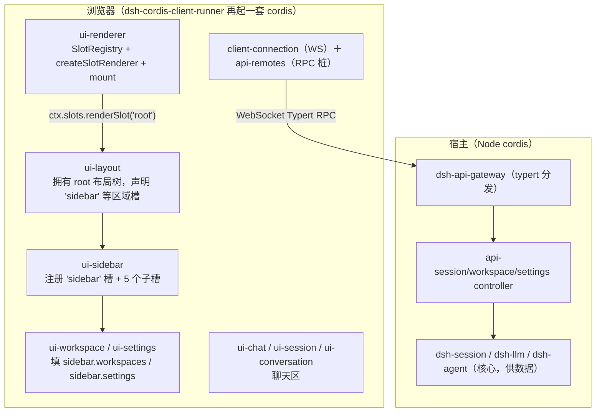

# dsh Web UI 前端插件系统研究

> 记录：2026-08-31 · 一手核验：`~/workspaces/dsh-alpha/packages/client/` 源码 +
> `packages/extensions/cordis-client-runner/` + vendored `@deepseek-ai/*` 4.x 编译产物
> （`~/.dsh/profiles/node_modules/@deepseek-ai/`，220 包）。
> 本文是 `../01-cordis-runtime/cordis-research.md`（Cordis 服务端侧）与 `web-frontend-composability-research.md`
> （Web 生态通用对照）的**dsh 实测侧**：回答"dsh 的 Web UI 到底是怎么把插件穿透到前端、又
> 怎么在 React 上渲染出来的"。

---

## 1. 一句话结论

**dsh 的 Web UI 不是"React 组件库"，而是把 Cordis 原封不动地搬进了浏览器：每个
`dsh-client-ui-*` 包是"双半插件"（服务端空 `apply()` + 浏览器端真 `apply(ctx)`），组合靠一套
框架无关的**插槽注册表（SlotRegistry）**——一个靠 TypeScript `declare module` 声明合并出来的
类型化 `SlotMap` 定义所有插槽契约，React 只是挂在注册表上的**一个可替换渲染后端**，状态用
框架无关的 observable 喂给 `useSyncExternalStore`。**

判定：这与服务端 Cordis 是**同一哲学的两个投影**——服务端用 `inject`/`provide` 组合 *服务*，
前端用 `register`/`renderSlot` 组合 *组件*；两者都是"声明式 + 控制反转 + 免重启装卸"。

---

## 2. 双半插件（dual-half）：一个包，两个编译目标

每个 `dsh-client-ui-*` 插件有两个入口文件，编译成两个目标：

**host 半**（服务端，空函数——只为让 Cordis Loader 有东西可加载）：

```ts
// packages/client/ui-sidebar/src/index.ts
/** Host loader entry for the browser-only sidebar plugin. */
/** Provides no host-side behavior. */
export function apply(): void {}
```

**browser 半**（浏览器里真正干活）：

```ts
// packages/client/ui-sidebar/src/client/index.ts
export const inject = ['slots', 'layout', 'uiWorkspace', 'locale']

export function apply(ctx: ClientContext): void {
  const workspaceNavigation = ctx.get('uiWorkspace')
  ctx.effect(() => ctx.locale.register(NS, { zh, en }), 'ui-sidebar: dictionaries')
  const injectProps = (): SidebarRootInjected => ({
    startSession: (workspaceId) => workspaceNavigation.startSession(workspaceId),
    toggleSidebar: () => ctx.layout.toggleSidebar(),
  })
  ctx.effect(
    () => ctx.slots.register({ name: 'sidebar', children: {...}, inject: injectProps }, SidebarRoot),
    'ui-sidebar: slot registration',
  )
}
```

关键点：`client/index.ts` 的 `apply(ctx)` 里有 `inject` 数组（`['slots', 'layout', ...]`）和
`ctx.effect(...)`——**和服务端 Cordis 插件完全一样的写法**。它跑在浏览器里，是因为下面第 8 节
的 `dsh-cordis-client-runner` 在浏览器里又起了一套 Cordis。

判定：服务端"组合服务"和前端"组合 UI"用的是**同一套心智模型**，只是换了个宿主（Node 进程 →
浏览器页面）。

---

## 3. 组合 = Slot：框架无关的类型化插槽注册表

前端的组合**不是** React 的 props 钻孔，也不是 React Context，而是一个**纯插槽注册表**
（`SlotCore`，无 cordis、无 React）：

```ts
// packages/client/ui-slots/src/index.ts
export interface SlotMap {}          // 空接口，靠各插件 declare module 合并
export interface LocaleNamespaceMap {}
export type SlotKind = 'single' | 'list' | 'keyed' | 'chain'
export type SlotScope = 'root' | 'session-maybe' | 'session'
```

每个插件通过 **TypeScript 声明合并** 往 `SlotMap` 上"合并"进自己的插槽名，于是**类型层面就知道
每个插槽的契约**：

```ts
// packages/client/ui-sidebar/src/client/contract/slots.ts
declare module '@deepseek-ai/dsh-client-ui-slots' {
  interface SlotMap {
    'sidebar.brand.mark': ...
    'sidebar.brand.name': ...
    'sidebar.workspaces': ...
    'sidebar.settings': ...
    'sidebar.footer.action': ...
  }
}
```

这与服务端 Cordis 的 `declare module '@deepseek-ai/cordis' { interface Context { slots: ... } }`
是**同一个机制**（`ui-renderer` 就是用它把 `ctx.slots`、`ctx.uiRenderer` 合并进 cordis Context）。

组合是**一棵树**：owner 注册时声明 `children`（子槽），occupant 填充别人的槽：

```
root（内置，唯一的 ctx 级槽）
  └─ layout 区域（ui-layout 拥有，声明 'sidebar' 等区域槽）
       └─ sidebar 壳（ui-sidebar 注册）
            ├─ sidebar.workspaces  ← ui-workspace 填充
            ├─ sidebar.settings    ← ui-settings 填充
            ├─ sidebar.brand.mark  ← ui-brand 填充
            └─ sidebar.footer.action（list 槽，多插件追加）
```

判定：**"谁声明槽"和"谁填槽"是两个正交的插件集**，靠 `SlotMap` 的类型合并保证编译期契约匹配
——这是它比"字符串 key + `any` props"的普通插件系统（如 VS Code views）高明的地方。

---

## 4. 插槽的两个轴：基数（kind）与作用域（scope）

```ts
type SlotKind = 'single' | 'list' | 'keyed' | 'chain'   // 单占位 / 有序列表 / 按 key 分发 / 选择器路由链
type SlotScope = 'root' | 'session-maybe' | 'session'   // 全局 / 可选当前会话 / 严格绑定会话
```

- **kind** 决定一个槽能容纳几个 occupant、怎么分发（`single` 一个、`list` 按顺序叠加、`keyed`
  按 key 分发、`chain` 用选择器决定路由）。
- **scope** 决定 occupant 是否/如何拿到当前 Session（`session` 槽会被注入 `sessionId` +
  `SessionProvider` 座，`session-maybe` 在无会话时收到 `undefined`，`root` 不接触会话）。

判定：基数轴覆盖了 UI 扩展点的四种真实形态；作用域轴把"会话数据怎么流进 UI"做成了类型级约束
（`PropsRuntime` 按 scope 收窄），而不是靠运行时约定。

---

## 5. React 渲染：整个 App = 一个 `root` 槽

这是最反直觉的一步——**整个 React 树只有一个入口**：

```tsx
// packages/client/ui-renderer/src/client/app.tsx
export function buildRenderApp(deps): () => ReactNode {
  const { ctx } = deps
  return () => ctx.slots.renderSlot('root', {})   // ← 整个 app 就这一句
}
```

```ts
// packages/client/ui-renderer/src/client/index.ts
export function apply(ctx: Context): void {
  const slots = new SlotRegistry(ctx)
  slots.install(createSlotRenderer())          // ← 把 React 渲染器装进插槽注册表
  ctx.reflect.provide('uiRenderer', {
    mount: (container) => {
      const root = mountApp(container, buildRenderApp({ ctx }))  // createRoot / hydrateRoot
      return () => root.unmount()
    },
  })
}
```

`SlotRegistry` 是 cordis 侧对 `SlotCore` 的包装；`createSlotRenderer()` 是**唯一一个 React 绑定**。
React 挂载后只渲染 `renderSlot('root')`，渲染器递归展开插槽树、找到每个槽的 occupant 渲染出来。

还有一段 boot 水合细节（`mountApp`）：如果容器里已有 kernel 预渲染的 `[data-dsh-boot]` DOM，就走
`hydrateRoot` 保活；否则 `createRoot` + `flushSync` 首帧。这是"框架无关的 boot DOM"→"React 接管"的
交接。

判定：**插槽注册表和状态都是框架中立的；React 只是"当前安装的那个渲染器"。** 理论上换一个
渲染器（如 preact / solid）只换 `createSlotRenderer()`，插槽树和业务插件一行不用改。

---

## 6. 每个插槽组件的 props 是"组合"出来的

一个 slot 组件收到的 props 是五份的交集（`ComposedProps`）：

| 份额 | 类型 | 来源 |
|---|---|---|
| **owner 分享** | `PropsRuntime`（`OwnerOf` + `KeyPropsOf` + scope 标准件） | 父级 `renderSlot` 调用点传的数据 |
| **render 分享** | `PropsRenderSlots<S>` | 子插槽的 `renderSlot` 函数，**静态收窄到声明的 `children`** |
| **store hooks** | `PropsStore` | 从 observable 源合成的 `use<Name>` 选择器 hook |
| **locale** | `PropsLocale` | `t` 翻译函数（按命名空间收窄 key） |
| **inject** | `InjectFace` | owner 注入的 `inject` 工厂（`hooks` 成员被转成 hook） |

侧栏的 `injectProps` 就是第 5 份的实例：把 `startSession`/`toggleSidebar` 通过 `inject` 工厂塞给
`SidebarRoot`，而 `SidebarRoot` 自己只消费 `PropsRenderSlots<'sidebar.brand.mark' | ...>` 去渲染
它声明的 5 个子槽。

判定：props 的每一份都有**编译期来源**（类型系统里能追到"谁给了什么"），不是运行时拼出来的
黑盒。这是它能"有求必应"又"不越权"的根基——owner 只拿到自己声明的 children 的 `renderSlot`，
occupant 只拿到 owner 声明的 `owner`/`inject` 分享。

---

## 7. 状态 = 框架无关的 observable → useSyncExternalStore

业务状态**不依赖 React**，是 `HostObservable<T>`（`getSnapshot` + `subscribe`）。React 绑定用
`useSyncExternalStore` 把它变成 hook：

```ts
// packages/client/ui-renderer/src/client/bindings.tsx
export function observableHook<T>(source: HostObservable<T>): SnapshotSelectorHook<T> { ... }
export function maybeObservableHook<T>(source: HostObservable<T> | undefined) { ... }  // 缺席保持 Hook 调用顺序稳定
export function keyedObservableHook(source: KeyedStandardSource | undefined) { ... }
```

一个 store 的 snapshot 变成组件里注入的 `use<Name>(selector)` hook（`standardHookPropName` 把源名
`foo` 转成 `useFoo`）。`use-sync-external-store` 是为了在 React 18 里拿到并发安全的订阅。

判定：**状态层是框架中立的，React 是纯渲染绑定。** 这和第 5 节同构——插槽和状态都跟框架解耦，
所以"换渲染器"不是说说而已。

---

## 8. 浏览器里的 Cordis + RPC 传输

`dsh-cordis-client-runner`（`packages/extensions/cordis-client-runner/src/client/`）在**浏览器里再
起一套完整 Cordis**，逐个调每个 UI 插件的 `client/index.ts` 的 `apply(ctx)`。它带齐了 cordis 的
运行时件：`runtime.ts`、`providers.ts`、`evaluator.ts`、`guard.ts`、`timer.ts`、`slot-catalog.ts`、
`orchestrator.ts`（页面侧的 run 编排 / 审批 / 面板手势）。

浏览器 → 服务端的通信是 **WebSocket 上的 Typert RPC**：

| 包 | 角色 |
|---|---|
| `dsh-client-connection` | 认证 RPC 传输（`ws`），生命周期管理 |
| `dsh-api-gateway` | Typert Remote Host 分发器（`ws` + schemastery 校验） |
| `dsh-api-remotes` | 客户端 RPC 桩（BFF 组装，会话/工作区/设置等面） |
| `dsh-api-*-controller` | 服务端 BFF 后端（session/workspace/settings） |

判定：浏览器里的 Cordis 服务通过 `inject` 拿到的是**远程能力的本地代理**（`dsh-api-remotes` 桩），
而非直接 import 服务端实现。这条 RPC 边界就是"前端插件"和"后端服务"的分界——也是我们桥接层
（omp-webui）要替换数据源的那条缝。

---

## 9. 完整链路（一张图）



---

## 10. 方法论提炼：为什么这么设计

把 dsh 前端这套机制抽象成三条方法论，与 Cordis 服务端一一对应：

1. **组合 = 类型化的注册表，不是字符串约定。** 服务端 `declare module '@deepseek-ai/cordis'`
   合并 `Context`；前端 `declare module '@deepseek-ai/dsh-client-ui-slots'` 合并 `SlotMap`。插槽
   契约是编译期检查的，不是文档口头约定。
2. **框架中立的内核 + 可替换的渲染后端。** `SlotCore`（无 cordis/React）+ observable（无 React）
   是内核；`createSlotRenderer()` 是唯一 React 绑定。对应 Cordis 的"框架内核 + 插件树"。
3. **双半部署。** 一个插件包编译成 host 半（空 `apply()`）+ browser 半（真逻辑），由 cordis 的
   `cordis-client-runner` 在两端各自加载。对应 Cordis 的"同一插件在两个运行时里各有一半"。

判定：这套东西的难点不在"能组合"（Web Components / MF 都能），而在**"依赖驱动的、反应式的、
类型安全的组合"**——`web-frontend-composability-research.md` §5 说 Web 生态缺的"反应式依赖激活"，
dsh 前端是用 **cordis 本身**补上的（浏览器里再跑一个 cordis），而不是在 DOM 层重造。

---

## 11. 对 omp-webui 桥接层的意义

这份研究直接回答了我们前几轮纠结的问题：

- **"能不能只复用 UI、自己写 HTTP 服务器？"** —— 不能干净地做。UI 插件是 dual-half，它的
  browser 半靠 `dsh-cordis-client-runner` 跑在浏览器 cordis 里、通过 `dsh-api-remotes` 的 RPC 桩
  调服务端；UI 的"前端组件"和"后端服务"不是 REST 边界，是 Typert RPC 边界。要复用 UI 就得
  把服务端 RPC 那半也搭起来。
- **"我们的桥接层到底替换了哪一段？"** —— 替换的是**数据源服务**（`dsh-session-persistence`
  → OMP 适配器、`dsh-agent-loop` → OMP provider、`dsh-agent-presets` → 单模式 roster），即第 8 节
  RPC 链**服务端**那一侧的几个 provider。**前端插槽树、渲染器、RPC 协议一行没动。**
- **"YAML 组合"的设想本来就存在。** 服务端是 `cordis.patch.yml`（定义加载哪些插件），前端是
  `SlotMap` + `register`/`renderSlot`（定义 UI 怎么组合）。我们要加 UI 面板，正确做法是**注册一个
  槽的 occupant**（`ctx.slots.register(...)`），而不是去改渲染器或重写插槽机制。

---

## 来源

- dsh-alpha 源码（`~/workspaces/dsh-alpha/packages/`）：
  - `client/ui-sidebar/src/index.ts`（host 半空 `apply()`）、`client/ui-sidebar/src/client/index.ts`
    （browser 半 `ctx.slots.register`）、`client/ui-sidebar/src/client/contract/slots.ts`（SlotMap 合并）
  - `client/ui-slots/src/index.ts`（`SlotMap`/`SlotKind`/`SlotScope`/`SlotCore`）、
    `client/ui-slots/src/renderer.ts`（框架中立契约 `SlotRendererHost`/`SlotRenderer`）
  - `client/ui-renderer/src/client/app.tsx`（`renderSlot('root')`）、
    `client/ui-renderer/src/client/index.ts`（`SlotRegistry` + `createSlotRenderer` + `mount`）、
    `client/ui-renderer/src/client/bindings.tsx`（observable → `useSyncExternalStore`）
  - `extensions/cordis-client-runner/src/client/orchestrator.ts`（浏览器 cordis 编排）
- vendored 编译产物：`~/.dsh/profiles/node_modules/@deepseek-ai/{dsh-web-app,dsh-web-frontend,
  dsh-cordis-client-runner,dsh-client-connection,dsh-api-gateway,dsh-api-remotes,dsh-client-ui-renderer,
  dsh-typert-protocol}/package.json`（description + peerDependencies 取证的依赖图）
- 关联研究：`../01-cordis-runtime/cordis-research.md`（Cordis 服务端时空可组合性）、`web-frontend-composability-research.md`
  （Web 生态通用对照，本文是其 dsh 实测侧）
